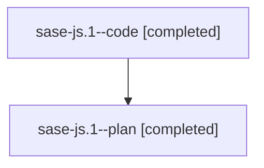

# Family: sase-js.1

[Agent Hoods](../README.md) / [bbugyi200](../users/bbugyi200/README.md) / [athena](../users/bbugyi200/machines/athena/README.md) / [sase-js](../users/bbugyi200/machines/athena/hoods/sase-js/README.md) / sase-js.1

Owner: `bbugyi200.athena` · Hood: `sase-js` · Members: 2 · Bead: [sase-js.1](https://github.com/sase-org/sase--beads/blob/main/pages/sase-js/sase-js.1.md)

## Lineage

The diagram is an optional enhancement; the ordered table below contains the same lineage in accessible text.

| Role | Agent | State | Model / provider | Timing | Commits | Prompt | Chat |
|---|---|---|---|---|---:|---|---|
| code | sase-js.1--code | completed | sonnet / claude | 2026-08-11T17:43:18.886868+00:00 | [1](../agents/bbugyi200.athena.sase-js.1--code/README.md#commits) | — | [Chat](../agents/bbugyi200.athena.sase-js.1--code/chat.md) |
| plan | sase-js.1--plan | completed | gpt-5.6-sol / codex | 2026-08-11T17:27:31.795116+00:00 | 0 | [Prompt](../agents/bbugyi200.athena.sase-js.1--plan/prompt.md) | [Chat](../agents/bbugyi200.athena.sase-js.1--plan/chat.md) |

## Commits

| Role | Repo | Commit | Subject | Committed |
|---|---|---|---|---|
| code | sase | [`cb453a5`](https://github.com/sase-org/sase/commit/cb453a529e483d4237afdfab66fd2be9e1caadeb) | feat(artifact-ref)!: bump wire schema to 5 for stitch/patch/file-path kinds | 2026-08-11 15:16:10 EDT |

## Neighbors

| Agent | Relation | State |
|---|---|---|
| [sase-js.2](../agents/bbugyi200.athena.sase-js.2/README.md) | sase-js hood | completed |
| [sase-js.3](bbugyi200.athena.sase-js.3.md) (family · 2) | sase-js hood | completed 2 |
| [sase-js.4](bbugyi200.athena.sase-js.4.md) (family · 2) | sase-js hood | completed 2 |
| [sase-js.5](bbugyi200.athena.sase-js.5.md) (family · 2) | sase-js hood | completed 2 |
| [sase-js.6](bbugyi200.athena.sase-js.6.md) (family · 2) | sase-js hood | completed 2 |
| [sase-js.7](bbugyi200.athena.sase-js.7.md) (family · 2) | sase-js hood | completed 2 |
| [sase-js.7](../agents/bbugyi200.athena.sase-js.7/README.md) | sase-js hood | waiting |
| [sase-js.8](bbugyi200.athena.sase-js.8.md) (family · 2) | sase-js hood | completed 2 |
| [sase-js.9](../agents/bbugyi200.athena.sase-js.9/README.md) | sase-js hood | completed |
| [sase-js.land](bbugyi200.athena.sase-js.land.md) (family · 2) | sase-js hood | active 2 |
