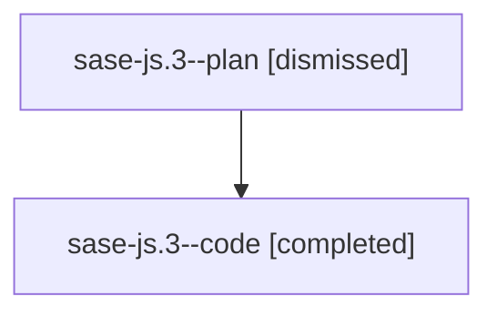

# Family: sase-js.3

[Agent Hoods](../README.md) / [bbugyi200](../users/bbugyi200/README.md) / [athena](../users/bbugyi200/machines/athena/README.md) / [sase-js](../users/bbugyi200/machines/athena/hoods/sase-js/README.md) / sase-js.3

Owner: `bbugyi200.athena` · Hood: `sase-js` · Members: 2 · Bead: [sase-js.3](https://github.com/sase-org/sase--beads/blob/main/pages/sase-js/sase-js.3.md)

## Lineage

The diagram is an optional enhancement; the ordered table below contains the same lineage in accessible text.

| Role | Agent | State | Model / provider | Timing | Commits | Prompt | Chat |
|---|---|---|---|---|---:|---|---|
| plan | sase-js.3--plan | dismissed | opus / claude | 2026-08-11T15:36:22.431977 → 2026-08-11T16:23:22.012458 | 0 | — | [Chat](../agents/bbugyi200.athena.sase-js.3--plan/chat.md) |
| code | sase-js.3--code | completed | gpt-5.5 / codex | 2026-08-11T19:43:35.724015+00:00 | [1](../agents/bbugyi200.athena.sase-js.3--code/README.md#commits) | — | [Chat](../agents/bbugyi200.athena.sase-js.3--code/chat.md) |

## Commits

| Role | Repo | Commit | Subject | Committed |
|---|---|---|---|---|
| code | sase | [`f53e43a`](https://github.com/sase-org/sase/commit/f53e43ab139a7db2c50b75971fb7a5fc202619e5) | feat!: add artifact provider registry | 2026-08-11 20:21:40 UTC |

## Neighbors

| Agent | Relation | State |
|---|---|---|
| [sase-js.1](bbugyi200.athena.sase-js.1.md) (family · 2) | sase-js hood | completed 1, dismissed 1 |
| [sase-js.2](../agents/bbugyi200.athena.sase-js.2/README.md) | sase-js hood | dismissed |
| [sase-js.4](bbugyi200.athena.sase-js.4.md) (family · 2) | sase-js hood | completed 1, dismissed 1 |
| [sase-js.5](bbugyi200.athena.sase-js.5.md) (family · 2) | sase-js hood | completed 1, dismissed 1 |
| [sase-js.6](bbugyi200.athena.sase-js.6.md) (family · 2) | sase-js hood | completed 1, dismissed 1 |
| [sase-js.7](bbugyi200.athena.sase-js.7.md) (family · 2) | sase-js hood | completed 1, dismissed 1 |
| [sase-js.7](../agents/bbugyi200.athena.sase-js.7/README.md) | sase-js hood | waiting |
| [sase-js.8](bbugyi200.athena.sase-js.8.md) (family · 2) | sase-js hood | completed 1, dismissed 1 |
| [sase-js.9](../agents/bbugyi200.athena.sase-js.9/README.md) | sase-js hood | dismissed |
| [sase-js.land](bbugyi200.athena.sase-js.land.md) (family · 2) | sase-js hood | active 1, dismissed 1 |
