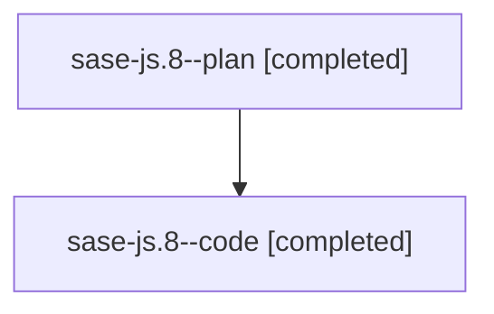

# Family: sase-js.8

[Agent Hoods](../README.md) / [bbugyi200](../users/bbugyi200/README.md) / [athena](../users/bbugyi200/machines/athena/README.md) / [sase-js](../users/bbugyi200/machines/athena/hoods/sase-js/README.md) / sase-js.8

Owner: `bbugyi200.athena` · Hood: `sase-js` · Members: 2 · Bead: [sase-js.8](https://github.com/sase-org/sase--beads/blob/main/pages/sase-js/sase-js.8.md)

## Lineage

The diagram is an optional enhancement; the ordered table below contains the same lineage in accessible text.

| Role | Agent | State | Model / provider | Timing | Commits | Prompt | Chat |
|---|---|---|---|---|---:|---|---|
| plan | sase-js.8--plan | completed | opus / claude | 2026-08-11T20:23:39.463808+00:00 | 0 | [Prompt](../agents/bbugyi200.athena.sase-js.8--plan/prompt.md) | [Chat](../agents/bbugyi200.athena.sase-js.8--plan/chat.md) |
| code | sase-js.8--code | completed | sonnet / claude | 2026-08-11T20:29:36.953759+00:00 | 0 | — | [Chat](../agents/bbugyi200.athena.sase-js.8--code/chat.md) |

## Neighbors

| Agent | Relation | State |
|---|---|---|
| [sase-js.1](bbugyi200.athena.sase-js.1.md) (family · 2) | sase-js hood | completed 2 |
| [sase-js.2](../agents/bbugyi200.athena.sase-js.2/README.md) | sase-js hood | completed |
| [sase-js.3](bbugyi200.athena.sase-js.3.md) (family · 2) | sase-js hood | completed 2 |
| [sase-js.4](bbugyi200.athena.sase-js.4.md) (family · 2) | sase-js hood | completed 2 |
| [sase-js.5](bbugyi200.athena.sase-js.5.md) (family · 2) | sase-js hood | completed 2 |
| [sase-js.6](../agents/bbugyi200.athena.sase-js.6/README.md) | sase-js hood | active |
| [sase-js.7](bbugyi200.athena.sase-js.7.md) (family · 2) | sase-js hood | active 2 |
| [sase-js.7](../agents/bbugyi200.athena.sase-js.7/README.md) | sase-js hood | waiting |
| [sase-js.9](../agents/bbugyi200.athena.sase-js.9/README.md) | sase-js hood | waiting |
| [sase-js.land](../agents/bbugyi200.athena.sase-js.land/README.md) | sase-js hood | waiting |
