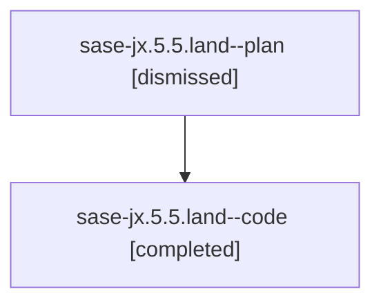

# Family: sase-jx.5.5.land

[Agent Hoods](../README.md) / [bbugyi200](../users/bbugyi200/README.md) / [athena](../users/bbugyi200/machines/athena/README.md) / [sase-jx](../users/bbugyi200/machines/athena/hoods/sase-jx/README.md) / sase-jx.5.5.land

Owner: `bbugyi200.athena` · Hood: `sase-jx` · Members: 2 · Bead: [sase-jx.5.5](https://github.com/sase-org/sase--beads/blob/main/pages/sase-jx/sase-jx.5.5.md)

## Lineage

The diagram is an optional enhancement; the ordered table below contains the same lineage in accessible text.

| Role | Agent | State | Model / provider | Timing | Commits | Prompt | Chat |
|---|---|---|---|---|---:|---|---|
| plan | sase-jx.5.5.land--plan | dismissed | opus / claude | 2026-08-12T15:01:30.373625 → 2026-08-12T15:44:17.851809 | 0 | — | [Chat](../agents/bbugyi200.athena.sase-jx.5.5.land--plan/chat.md) |
| code | sase-jx.5.5.land--code | completed | gpt-5.5 / codex | 2026-08-12T19:29:17.835447+00:00 | [1](../agents/bbugyi200.athena.sase-jx.5.5.land--code/README.md#commits) | — | [Chat](../agents/bbugyi200.athena.sase-jx.5.5.land--code/chat.md) |

## Commits

| Role | Repo | Commit | Subject | Committed |
|---|---|---|---|---|
| code | sase | [`2ba70f0`](https://github.com/sase-org/sase/commit/2ba70f07f2c33352a8454da1188b5365ba5c0dcd) | test(axe): rebaseline compact layout goldens | 2026-08-12 19:35:25 UTC |

## Neighbors

| Agent | Relation | State |
|---|---|---|
| [sase-jx.5.5.1](../agents/bbugyi200.athena.sase-jx.5.5.1/README.md) | sase-jx.5.5 hood | dismissed |
| [sase-jx.5.5.2](../agents/bbugyi200.athena.sase-jx.5.5.2/README.md) | sase-jx.5.5 hood | dismissed |
| [sase-jx.5.1](../agents/bbugyi200.athena.sase-jx.5.1/README.md) | sase-jx.5 hood | dismissed |
| [sase-jx.5.2](../agents/bbugyi200.athena.sase-jx.5.2/README.md) | sase-jx.5 hood | dismissed |
| [sase-jx.5.3](../agents/bbugyi200.athena.sase-jx.5.3/README.md) | sase-jx.5 hood | dismissed |
| [sase-jx.5.4](../agents/bbugyi200.athena.sase-jx.5.4/README.md) | sase-jx.5 hood | dismissed |
| [sase-jx.5.land](../agents/bbugyi200.athena.sase-jx.5.land/README.md) | sase-jx.5 hood | dismissed |
| [sase-jx.1](../agents/bbugyi200.athena.sase-jx.1/README.md) | sase-jx hood | dismissed |
| [sase-jx.2](../agents/bbugyi200.athena.sase-jx.2/README.md) | sase-jx hood | dismissed |
| [sase-jx.3](../agents/bbugyi200.athena.sase-jx.3/README.md) | sase-jx hood | dismissed |
| [sase-jx.4](../agents/bbugyi200.athena.sase-jx.4/README.md) | sase-jx hood | dismissed |
| [sase-jx.land](../agents/bbugyi200.athena.sase-jx.land/README.md) | sase-jx hood | dismissed |
