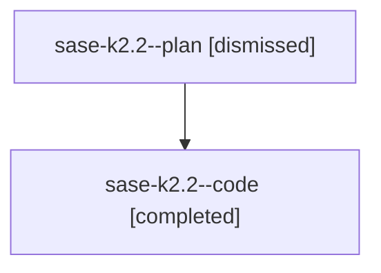

# Family: sase-k2.2

[Agent Hoods](../README.md) / [bbugyi200](../users/bbugyi200/README.md) / [athena](../users/bbugyi200/machines/athena/README.md) / [sase-k2](../users/bbugyi200/machines/athena/hoods/sase-k2/README.md) / sase-k2.2

Owner: `bbugyi200.athena` · Hood: `sase-k2` · Members: 2 · Bead: [sase-k2.2](https://github.com/sase-org/sase--beads/blob/main/pages/sase-k2/sase-k2.2.md)

## Lineage

The diagram is an optional enhancement; the ordered table below contains the same lineage in accessible text.

| Role | Agent | State | Model / provider | Timing | Commits | Prompt | Chat |
|---|---|---|---|---|---:|---|---|
| plan | sase-k2.2--plan | dismissed | opus / claude | 2026-08-12T11:35:25.758896 → 2026-08-12T12:45:23.983018 | 0 | — | [Chat](../agents/bbugyi200.athena.sase-k2.2--plan/chat.md) |
| code | sase-k2.2--code | completed | sonnet / claude | 2026-08-12T15:51:03.828033+00:00 | 0 | — | [Chat](../agents/bbugyi200.athena.sase-k2.2--code/chat.md) |

## Commits

| Role | Repo | Commit | Subject | Committed |
|---|---|---|---|---|
| — | sase | [`6b139a0`](https://github.com/sase-org/sase/commit/6b139a0d46843de54af4ebec5d28b25925215298) | feat(external-mirror): add configurable glob filters for issues and PRs | 2026-08-12 12:41:30 EDT |

## Neighbors

| Agent | Relation | State |
|---|---|---|
| [sase-k2.1](bbugyi200.athena.sase-k2.1.md) (family · 2) | sase-k2 hood | completed 1, dismissed 1 |
| [sase-k2.3](../agents/bbugyi200.athena.sase-k2.3/README.md) | sase-k2 hood | dismissed |
| [sase-k2.4](bbugyi200.athena.sase-k2.4.md) (family · 2) | sase-k2 hood | completed 1, dismissed 1 |
| [sase-k2.5](bbugyi200.athena.sase-k2.5.md) (family · 2) | sase-k2 hood | dismissed 2 |
| [sase-k2.5](../agents/bbugyi200.athena.sase-k2.5/README.md) | sase-k2 hood | completed |
| [sase-k2.6](../agents/bbugyi200.athena.sase-k2.6/README.md) | sase-k2 hood | dismissed |
| [sase-k2.land](../agents/bbugyi200.athena.sase-k2.land/README.md) | sase-k2 hood | dismissed |
