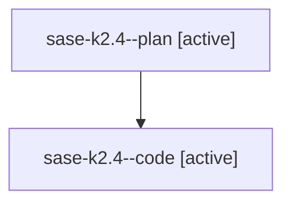

# Family: sase-k2.4

[Agent Hoods](../README.md) / [bbugyi200](../users/bbugyi200/README.md) / [athena](../users/bbugyi200/machines/athena/README.md) / [sase-k2](../users/bbugyi200/machines/athena/hoods/sase-k2/README.md) / sase-k2.4

Owner: `bbugyi200.athena` · Hood: `sase-k2` · Members: 2 · Bead: [sase-k2.4](https://github.com/sase-org/sase--beads/blob/main/pages/sase-k2/sase-k2.4.md)

## Lineage

The diagram is an optional enhancement; the ordered table below contains the same lineage in accessible text.

| Role | Agent | State | Model / provider | Timing | Commits | Prompt | Chat |
|---|---|---|---|---|---:|---|---|
| plan | sase-k2.4--plan | active | gpt-5.6-sol / codex | 2026-08-12T16:45:47.945390+00:00 | 0 | [Prompt](../agents/bbugyi200.athena.sase-k2.4--plan/prompt.md) | [Chat](../agents/bbugyi200.athena.sase-k2.4--plan/chat.md) |
| code | sase-k2.4--code | active | gpt-5.5 / codex | 2026-08-12T16:56:04.893364+00:00 | 0 | — | — |

## Neighbors

| Agent | Relation | State |
|---|---|---|
| [sase-k2.1](bbugyi200.athena.sase-k2.1.md) (family · 2) | sase-k2 hood | completed 2 |
| [sase-k2.2](bbugyi200.athena.sase-k2.2.md) (family · 2) | sase-k2 hood | completed 2 |
| [sase-k2.3](../agents/bbugyi200.athena.sase-k2.3/README.md) | sase-k2 hood | completed |
| [sase-k2.5](bbugyi200.athena.sase-k2.5.md) (family · 1) | sase-k2 hood | completed 1 |
| [sase-k2.5](../agents/bbugyi200.athena.sase-k2.5/README.md) | sase-k2 hood | completed |
| [sase-k2.6](../agents/bbugyi200.athena.sase-k2.6/README.md) | sase-k2 hood | completed |
| [sase-k2.land](../agents/bbugyi200.athena.sase-k2.land/README.md) | sase-k2 hood | waiting |
