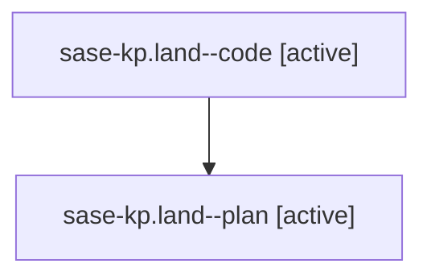

# Family: sase-kp.land

[Agent Hoods](../README.md) / [bbugyi200](../users/bbugyi200/README.md) / [athena](../users/bbugyi200/machines/athena/README.md) / [sase-kp](../users/bbugyi200/machines/athena/hoods/sase-kp/README.md) / sase-kp.land

Owner: `bbugyi200.athena` · Hood: `sase-kp` · Members: 2 · Bead: [sase-kp](https://github.com/sase-org/sase--beads/blob/main/pages/sase-kp/README.md)

## Lineage

The diagram is an optional enhancement; the ordered table below contains the same lineage in accessible text.

| Role | Agent | State | Model / provider | Timing | Commits | Prompt | Chat |
|---|---|---|---|---|---:|---|---|
| code | sase-kp.land--code | active | sonnet / claude | 2026-08-13T11:56:52.543596+00:00 | 0 | — | — |
| plan | sase-kp.land--plan | active | opus / claude | 2026-08-13T11:38:13.195673+00:00 | 0 | [Prompt](../agents/bbugyi200.athena.sase-kp.land--plan/prompt.md) | [Chat](../agents/bbugyi200.athena.sase-kp.land--plan/chat.md) |

## Neighbors

| Agent | Relation | State |
|---|---|---|
| [sase-kp.1](../agents/bbugyi200.athena.sase-kp.1/README.md) | sase-kp hood | completed |
| [sase-kp.10](../agents/bbugyi200.athena.sase-kp.10/README.md) | sase-kp hood | completed |
| [sase-kp.11](../agents/bbugyi200.athena.sase-kp.11/README.md) | sase-kp hood | completed |
| [sase-kp.12](../agents/bbugyi200.athena.sase-kp.12/README.md) | sase-kp hood | completed |
| [sase-kp.2](../agents/bbugyi200.athena.sase-kp.2/README.md) | sase-kp hood | completed |
| [sase-kp.3](../agents/bbugyi200.athena.sase-kp.3/README.md) | sase-kp hood | completed |
| [sase-kp.4](../agents/bbugyi200.athena.sase-kp.4/README.md) | sase-kp hood | completed |
| [sase-kp.5](../agents/bbugyi200.athena.sase-kp.5/README.md) | sase-kp hood | completed |
| [sase-kp.6](../agents/bbugyi200.athena.sase-kp.6/README.md) | sase-kp hood | completed |
| [sase-kp.7](../agents/bbugyi200.athena.sase-kp.7/README.md) | sase-kp hood | completed |
| [sase-kp.8](../agents/bbugyi200.athena.sase-kp.8/README.md) | sase-kp hood | completed |
| [sase-kp.9](../agents/bbugyi200.athena.sase-kp.9/README.md) | sase-kp hood | completed |
