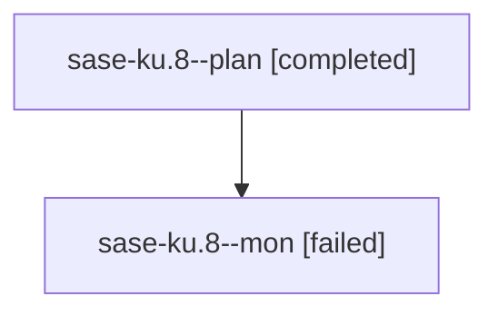

# Family: sase-ku.8

[Agent Hoods](../README.md) / [bbugyi200](../users/bbugyi200/README.md) / [athena](../users/bbugyi200/machines/athena/README.md) / [sase-ku](../users/bbugyi200/machines/athena/hoods/sase-ku/README.md) / sase-ku.8

Owner: `bbugyi200.athena` · Hood: `sase-ku` · Members: 2 · Bead: [sase-ku.8](https://github.com/sase-org/sase--beads/blob/main/pages/sase-ku/sase-ku.8.md)

## Lineage

The diagram is an optional enhancement; the ordered table below contains the same lineage in accessible text.

| Role | Agent | State | Model / provider | Timing | Commits | Prompt | Chat |
|---|---|---|---|---|---:|---|---|
| plan | sase-ku.8--plan | completed | gpt-5.5 / codex | 2026-08-13T15:17:38.966917+00:00 | [1](../agents/bbugyi200.athena.sase-ku.8--plan/README.md#commits) | [Prompt](../agents/bbugyi200.athena.sase-ku.8--plan/prompt.md) | [Chat](../agents/bbugyi200.athena.sase-ku.8--plan/chat.md) |
| mon | sase-ku.8--mon | failed | gpt-5.5 / codex | 2026-08-13T17:22:50.778863+00:00 | 0 | — | [Chat](../agents/bbugyi200.athena.sase-ku.8--mon/chat.md) |

## Commits

| Role | Repo | Commit | Subject | Committed |
|---|---|---|---|---|
| plan | sase | [`df17a07`](https://github.com/sase-org/sase/commit/df17a078a430834d5113051d1712e54b139d97fd) | fix(monitor): close fidelity gaps between monitor output and reality | 2026-08-13 15:38:56 UTC |

## Neighbors

| Agent | Relation | State |
|---|---|---|
| [sase-ku.1](../agents/bbugyi200.athena.sase-ku.1/README.md) | sase-ku hood | completed |
| [sase-ku.10](bbugyi200.athena.sase-ku.10.md) (family · 5) | sase-ku hood | completed 2, failed 3 |
| [sase-ku.2](../agents/bbugyi200.athena.sase-ku.2/README.md) | sase-ku hood | completed |
| [sase-ku.3](../agents/bbugyi200.athena.sase-ku.3/README.md) | sase-ku hood | completed |
| [sase-ku.4](bbugyi200.athena.sase-ku.4.md) (family · 2) | sase-ku hood | completed 1, failed 1 |
| [sase-ku.4](../agents/bbugyi200.athena.sase-ku.4/README.md) | sase-ku hood | completed |
| [sase-ku.5](bbugyi200.athena.sase-ku.5.md) (family · 3) | sase-ku hood | completed 2, failed 1 |
| [sase-ku.5](../agents/bbugyi200.athena.sase-ku.5/README.md) | sase-ku hood | completed |
| [sase-ku.6](bbugyi200.athena.sase-ku.6.md) (family · 2) | sase-ku hood | completed 1, failed 1 |
| [sase-ku.6](../agents/bbugyi200.athena.sase-ku.6/README.md) | sase-ku hood | completed |
| [sase-ku.7](bbugyi200.athena.sase-ku.7.md) (family · 2) | sase-ku hood | completed 1, failed 1 |
| [sase-ku.7](../agents/bbugyi200.athena.sase-ku.7/README.md) | sase-ku hood | completed |
| [sase-ku.9](bbugyi200.athena.sase-ku.9.md) (family · 2) | sase-ku hood | completed 1, failed 1 |
| [sase-ku.9](../agents/bbugyi200.athena.sase-ku.9/README.md) | sase-ku hood | completed |
| [sase-ku.land](../agents/bbugyi200.athena.sase-ku.land/README.md) | sase-ku hood | active |
