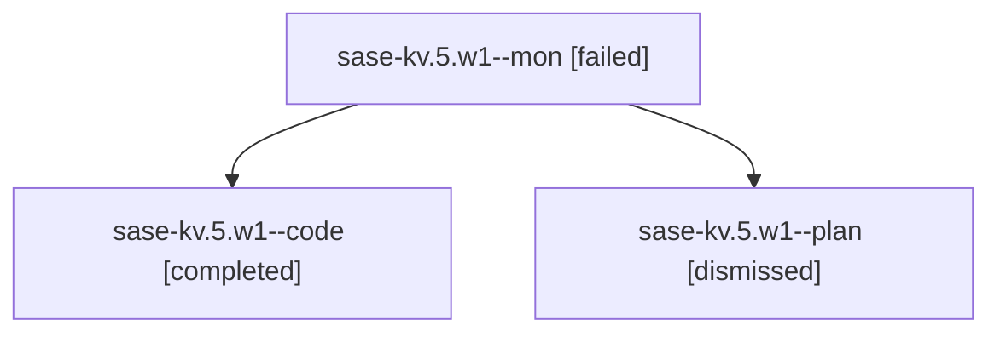

# Family: sase-kv.5.w1

[Agent Hoods](../README.md) / [bbugyi200](../users/bbugyi200/README.md) / [athena](../users/bbugyi200/machines/athena/README.md) / [sase-kv](../users/bbugyi200/machines/athena/hoods/sase-kv/README.md) / sase-kv.5.w1

Owner: `bbugyi200.athena` · Hood: `sase-kv` · Members: 3

## Lineage

The diagram is an optional enhancement; the ordered table below contains the same lineage in accessible text.

| Role | Agent | State | Model / provider | Timing | Commits | Prompt | Chat |
|---|---|---|---|---|---:|---|---|
| mon | sase-kv.5.w1--mon | failed | sonnet / claude | 2026-08-13T15:07:50.807241+00:00 | 0 | — | [Chat](../agents/bbugyi200.athena.sase-kv.5.w1--mon/chat.md) |
| code | sase-kv.5.w1--code | completed | sonnet / claude | 2026-08-13T14:53:46.744046+00:00 | 0 | — | [Chat](../agents/bbugyi200.athena.sase-kv.5.w1--code/chat.md) |
| plan | sase-kv.5.w1--plan | dismissed | opus / claude | 2026-08-13T10:46:14.542335 → 2026-08-13T11:08:02.697075 | 0 | — | [Chat](../agents/bbugyi200.athena.sase-kv.5.w1--plan/chat.md) |

## Neighbors

| Agent | Relation | State |
|---|---|---|
| [sase-kv.5](../agents/bbugyi200.athena.sase-kv.5/README.md) | ancestor | completed |
| [sase-kv.5.w1.f0](../agents/bbugyi200.athena.sase-kv.5.w1.f0/README.md) | descendant | dismissed |
| [sase-kv.5.w1.w0](../agents/bbugyi200.athena.sase-kv.5.w1.w0/README.md) | descendant | dismissed |
| [sase-kv.5.w0.f0](../agents/bbugyi200.athena.sase-kv.5.w0.f0/README.md) | sase-kv.5 hood | dismissed |
| [sase-kv.5.w0.w0](../agents/bbugyi200.athena.sase-kv.5.w0.w0/README.md) | sase-kv.5 hood | dismissed |
| [sase-kv.1](../agents/bbugyi200.athena.sase-kv.1/README.md) | sase-kv hood | completed |
| [sase-kv.2](../agents/bbugyi200.athena.sase-kv.2/README.md) | sase-kv hood | completed |
| [sase-kv.3](../agents/bbugyi200.athena.sase-kv.3/README.md) | sase-kv hood | completed |
| [sase-kv.4](../agents/bbugyi200.athena.sase-kv.4/README.md) | sase-kv hood | completed |
| [sase-kv.land](../agents/bbugyi200.athena.sase-kv.land/README.md) | sase-kv hood | completed |
