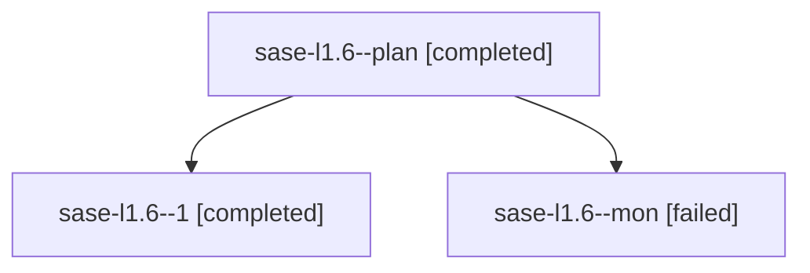

# Family: sase-l1.6

[Agent Hoods](../README.md) / [bbugyi200](../users/bbugyi200/README.md) / [athena](../users/bbugyi200/machines/athena/README.md) / [sase-l1](../users/bbugyi200/machines/athena/hoods/sase-l1/README.md) / sase-l1.6

Owner: `bbugyi200.athena` · Hood: `sase-l1` · Members: 3 · Bead: [sase-l1.6](https://github.com/sase-org/sase--beads/blob/main/pages/sase-l1/sase-l1.6.md)

## Lineage

The diagram is an optional enhancement; the ordered table below contains the same lineage in accessible text.

| Role | Agent | State | Model / provider | Timing | Commits | Prompt | Chat |
|---|---|---|---|---|---:|---|---|
| plan | sase-l1.6--plan | completed | sonnet / claude | 2026-08-13T19:42:51.969428+00:00 | 0 | [Prompt](../agents/bbugyi200.athena.sase-l1.6--plan/prompt.md) | [Chat](../agents/bbugyi200.athena.sase-l1.6--plan/chat.md) |
| 1 | sase-l1.6--1 | completed | sonnet / claude | 2026-08-13T19:59:37.913926+00:00 | 0 | [Prompt](../agents/bbugyi200.athena.sase-l1.6--1/prompt.md) | [Chat](../agents/bbugyi200.athena.sase-l1.6--1/chat.md) |
| mon | sase-l1.6--mon | failed | sonnet / claude | 2026-08-13T19:53:16.251386+00:00 | 0 | — | [Chat](../agents/bbugyi200.athena.sase-l1.6--mon/chat.md) |

## Neighbors

| Agent | Relation | State |
|---|---|---|
| [sase-l1.1](../agents/bbugyi200.athena.sase-l1.1/README.md) | sase-l1 hood | completed |
| [sase-l1.2](../agents/bbugyi200.athena.sase-l1.2/README.md) | sase-l1 hood | completed |
| [sase-l1.3](../agents/bbugyi200.athena.sase-l1.3/README.md) | sase-l1 hood | completed |
| [sase-l1.4](../agents/bbugyi200.athena.sase-l1.4/README.md) | sase-l1 hood | completed |
| [sase-l1.5](../agents/bbugyi200.athena.sase-l1.5/README.md) | sase-l1 hood | completed |
| [sase-l1.land](../agents/bbugyi200.athena.sase-l1.land/README.md) | sase-l1 hood | completed |
