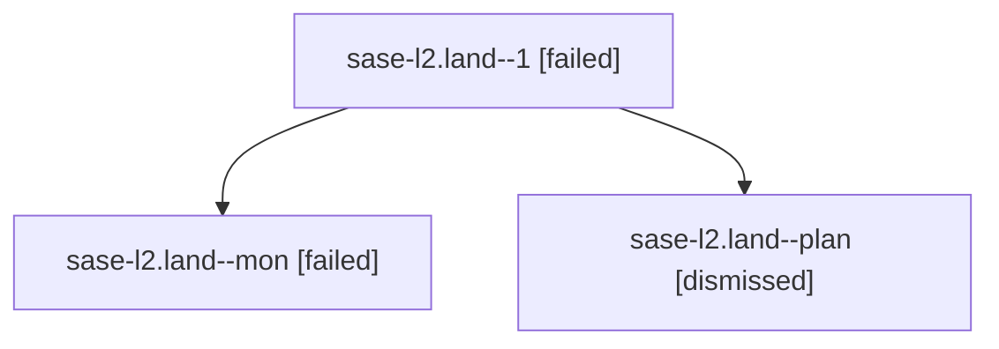

# Family: sase-l2.land

[Agent Hoods](../README.md) / [bbugyi200](../users/bbugyi200/README.md) / [athena](../users/bbugyi200/machines/athena/README.md) / [sase-l2](../users/bbugyi200/machines/athena/hoods/sase-l2/README.md) / sase-l2.land

Owner: `bbugyi200.athena` · Hood: `sase-l2` · Members: 3 · Bead: [sase-l2](https://github.com/sase-org/sase--beads/blob/main/pages/sase-l2/README.md)

## Lineage

The diagram is an optional enhancement; the ordered table below contains the same lineage in accessible text.

| Role | Agent | State | Model / provider | Timing | Commits | Prompt | Chat |
|---|---|---|---|---|---:|---|---|
| 1 | sase-l2.land--1 | failed | opus / claude | 2026-08-13T19:24:48.572906+00:00 | 0 | [Prompt](../agents/bbugyi200.athena.sase-l2.land--1/prompt.md) | — |
| mon | sase-l2.land--mon | failed | opus / claude | 2026-08-13T19:22:14.163316+00:00 | 0 | — | [Chat](../agents/bbugyi200.athena.sase-l2.land--mon/chat.md) |
| plan | sase-l2.land--plan | dismissed | opus / claude | 2026-08-13T15:09:38.968548 → 2026-08-13T15:22:20.529157 | 0 | — | [Chat](../agents/bbugyi200.athena.sase-l2.land--plan/chat.md) |

## Neighbors

| Agent | Relation | State |
|---|---|---|
| [sase-l2.1](../agents/bbugyi200.athena.sase-l2.1/README.md) | sase-l2 hood | dismissed |
| [sase-l2.2](../agents/bbugyi200.athena.sase-l2.2/README.md) | sase-l2 hood | dismissed |
| [sase-l2.3](../agents/bbugyi200.athena.sase-l2.3/README.md) | sase-l2 hood | dismissed |
