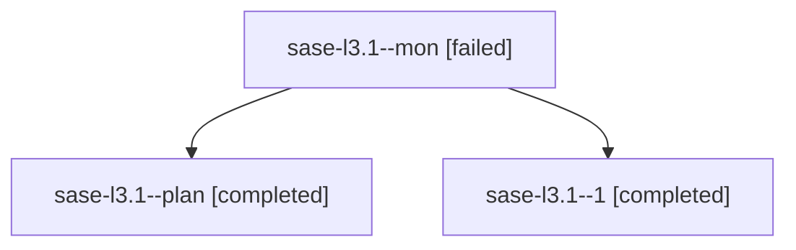

# Family: sase-l3.1

[Agent Hoods](../README.md) / [bbugyi200](../users/bbugyi200/README.md) / [athena](../users/bbugyi200/machines/athena/README.md) / [sase-l3](../users/bbugyi200/machines/athena/hoods/sase-l3/README.md) / sase-l3.1

Owner: `bbugyi200.athena` · Hood: `sase-l3` · Members: 3 · Bead: [sase-l3.1](https://github.com/sase-org/sase--beads/blob/main/pages/sase-l3/sase-l3.1.md)

## Lineage

The diagram is an optional enhancement; the ordered table below contains the same lineage in accessible text.

| Role | Agent | State | Model / provider | Timing | Commits | Prompt | Chat |
|---|---|---|---|---|---:|---|---|
| mon | sase-l3.1--mon | failed | gpt-5.5 / codex | 2026-08-13T19:02:02.773519+00:00 | 0 | — | [Chat](../agents/bbugyi200.athena.sase-l3.1--mon/chat.md) |
| plan | sase-l3.1--plan | completed | gpt-5.5 / codex | 2026-08-13T18:52:35.303810+00:00 | 0 | [Prompt](../agents/bbugyi200.athena.sase-l3.1--plan/prompt.md) | [Chat](../agents/bbugyi200.athena.sase-l3.1--plan/chat.md) |
| 1 | sase-l3.1--1 | completed | gpt-5.5 / codex | 2026-08-13T19:03:56.501149+00:00 | [1](../agents/bbugyi200.athena.sase-l3.1--1/README.md#commits) | [Prompt](../agents/bbugyi200.athena.sase-l3.1--1/prompt.md) | [Chat](../agents/bbugyi200.athena.sase-l3.1--1/chat.md) |

## Commits

| Role | Repo | Commit | Subject | Committed |
|---|---|---|---|---|
| 1 | sase | [`ad4ae62`](https://github.com/sase-org/sase/commit/ad4ae62aef705022872998254613c72e068a6d43) | feat(llm-provider): add provider-neutral messages parser | 2026-08-13 15:23:41 EDT |

## Neighbors

| Agent | Relation | State |
|---|---|---|
| [sase-l3.2](../agents/bbugyi200.athena.sase-l3.2/README.md) | sase-l3 hood | completed |
| [sase-l3.3](../agents/bbugyi200.athena.sase-l3.3/README.md) | sase-l3 hood | completed |
| [sase-l3.4](../agents/bbugyi200.athena.sase-l3.4/README.md) | sase-l3 hood | completed |
| [sase-l3.5](../agents/bbugyi200.athena.sase-l3.5/README.md) | sase-l3 hood | active |
| [sase-l3.6](../agents/bbugyi200.athena.sase-l3.6/README.md) | sase-l3 hood | completed |
| [sase-l3.7](../agents/bbugyi200.athena.sase-l3.7/README.md) | sase-l3 hood | waiting |
| [sase-l3.8](../agents/bbugyi200.athena.sase-l3.8/README.md) | sase-l3 hood | waiting |
| [sase-l3.land](../agents/bbugyi200.athena.sase-l3.land/README.md) | sase-l3 hood | waiting |
