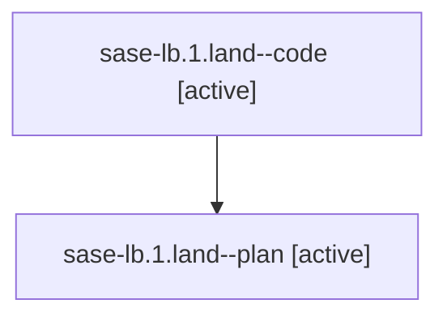

# Family: sase-lb.1.land

[Agent Hoods](../README.md) / [bbugyi200](../users/bbugyi200/README.md) / [athena](../users/bbugyi200/machines/athena/README.md) / [sase-lb](../users/bbugyi200/machines/athena/hoods/sase-lb/README.md) / sase-lb.1.land

Owner: `bbugyi200.athena` · Hood: `sase-lb` · Members: 2 · Bead: [sase-lb.1](https://github.com/sase-org/sase--beads/blob/main/pages/sase-lb/sase-lb.1.md)

## Lineage

The diagram is an optional enhancement; the ordered table below contains the same lineage in accessible text.

| Role | Agent | State | Model / provider | Timing | Commits | Prompt | Chat |
|---|---|---|---|---|---:|---|---|
| code | sase-lb.1.land--code | active | sonnet / claude | 2026-08-14T17:08:36.126132+00:00 | 0 | — | — |
| plan | sase-lb.1.land--plan | active | opus / claude | 2026-08-14T16:51:27.300219+00:00 | 0 | [Prompt](../agents/bbugyi200.athena.sase-lb.1.land--plan/prompt.md) | [Chat](../agents/bbugyi200.athena.sase-lb.1.land--plan/chat.md) |

## Neighbors

| Agent | Relation | State |
|---|---|---|
| [sase-lb.1.1](../agents/bbugyi200.athena.sase-lb.1.1/README.md) | sase-lb.1 hood | completed |
| [sase-lb.1.2](../agents/bbugyi200.athena.sase-lb.1.2/README.md) | sase-lb.1 hood | completed |
| [sase-lb.1.3](../agents/bbugyi200.athena.sase-lb.1.3/README.md) | sase-lb.1 hood | completed |
| [sase-lb.1.4](../agents/bbugyi200.athena.sase-lb.1.4/README.md) | sase-lb.1 hood | completed |
| [sase-lb.1.5](../agents/bbugyi200.athena.sase-lb.1.5/README.md) | sase-lb.1 hood | completed |
| [sase-lb.1.6](../agents/bbugyi200.athena.sase-lb.1.6/README.md) | sase-lb.1 hood | completed |
| [sase-lb.1.7](../agents/bbugyi200.athena.sase-lb.1.7/README.md) | sase-lb.1 hood | completed |
