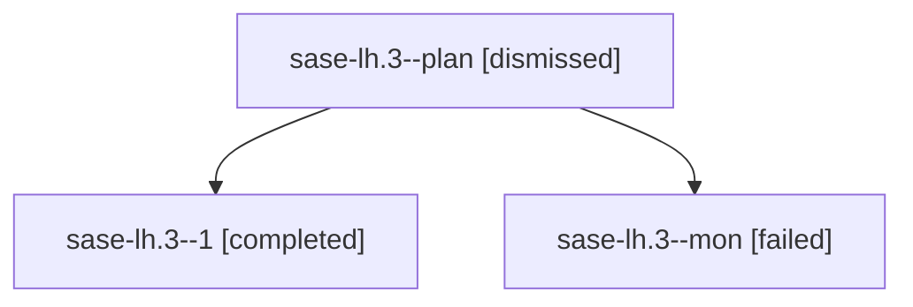

# Family: sase-lh.3

[Agent Hoods](../README.md) / [bbugyi200](../users/bbugyi200/README.md) / [athena](../users/bbugyi200/machines/athena/README.md) / [sase-lh](../users/bbugyi200/machines/athena/hoods/sase-lh/README.md) / sase-lh.3

Owner: `bbugyi200.athena` · Hood: `sase-lh` · Members: 3 · Bead: [sase-lh.3](https://github.com/sase-org/sase--beads/blob/main/pages/sase-lh/sase-lh.3.md)

## Lineage

The diagram is an optional enhancement; the ordered table below contains the same lineage in accessible text.

| Role | Agent | State | Model / provider | Timing | Commits | Prompt | Chat |
|---|---|---|---|---|---:|---|---|
| plan | sase-lh.3--plan | dismissed | sonnet / claude | 2026-08-13T20:14:52.815271 → 2026-08-13T21:06:20.407143 | 0 | — | [Chat](../agents/bbugyi200.athena.sase-lh.3--plan/chat.md) |
| 1 | sase-lh.3--1 | completed | sonnet / claude | 2026-08-14T01:18:13.999487+00:00 | 0 | [Prompt](../agents/bbugyi200.athena.sase-lh.3--1/prompt.md) | [Chat](../agents/bbugyi200.athena.sase-lh.3--1/chat.md) |
| mon | sase-lh.3--mon | failed | sonnet / claude | 2026-08-14T00:51:14.882914+00:00 | 0 | — | [Chat](../agents/bbugyi200.athena.sase-lh.3--mon/chat.md) |

## Commits

| Role | Repo | Commit | Subject | Committed |
|---|---|---|---|---|
| — | sase | [`a0e9ae4`](https://github.com/sase-org/sase/commit/a0e9ae4ed310014524237059a39069cee9b7d566) | feat(cli)!: rename task command to proc | 2026-08-14 01:05:16 UTC |

## Neighbors

| Agent | Relation | State |
|---|---|---|
| [sase-lh.1](../agents/bbugyi200.athena.sase-lh.1/README.md) | sase-lh hood | dismissed |
| [sase-lh.2](../agents/bbugyi200.athena.sase-lh.2/README.md) | sase-lh hood | dismissed |
| [sase-lh.4](../agents/bbugyi200.athena.sase-lh.4/README.md) | sase-lh hood | dismissed |
| [sase-lh.5](../agents/bbugyi200.athena.sase-lh.5/README.md) | sase-lh hood | dismissed |
| [sase-lh.6](../agents/bbugyi200.athena.sase-lh.6/README.md) | sase-lh hood | dismissed |
| [sase-lh.7](../agents/bbugyi200.athena.sase-lh.7/README.md) | sase-lh hood | dismissed |
| [sase-lh.8](../agents/bbugyi200.athena.sase-lh.8/README.md) | sase-lh hood | dismissed |
| [sase-lh.land](bbugyi200.athena.sase-lh.land.md) (family · 5) | sase-lh hood | completed 2, dismissed 1, failed 2 |
