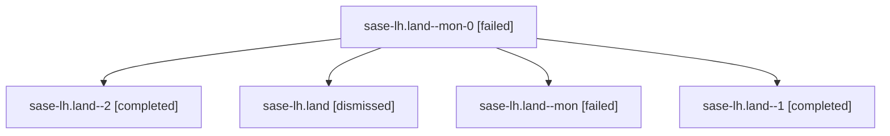

# Family: sase-lh.land

[Agent Hoods](../README.md) / [bbugyi200](../users/bbugyi200/README.md) / [athena](../users/bbugyi200/machines/athena/README.md) / [sase-lh](../users/bbugyi200/machines/athena/hoods/sase-lh/README.md) / sase-lh.land

Owner: `bbugyi200.athena` · Hood: `sase-lh` · Members: 5 · Bead: [sase-lh](https://github.com/sase-org/sase--beads/blob/main/pages/sase-lh/README.md)

## Lineage

The diagram is an optional enhancement; the ordered table below contains the same lineage in accessible text.

| Role | Agent | State | Model / provider | Timing | Commits | Prompt | Chat |
|---|---|---|---|---|---:|---|---|
| mon-0 | sase-lh.land--mon-0 | failed | opus / claude | 2026-08-14T03:47:21.118873+00:00 | 0 | — | [Chat](../agents/bbugyi200.athena.sase-lh.land--mon-0/chat.md) |
| 2 | sase-lh.land--2 | completed | opus / claude | 2026-08-14T03:57:59.477635+00:00 | [1](../agents/bbugyi200.athena.sase-lh.land--2/README.md#commits) | [Prompt](../agents/bbugyi200.athena.sase-lh.land--2/prompt.md) | [Chat](../agents/bbugyi200.athena.sase-lh.land--2/chat.md) |
| root | sase-lh.land | dismissed | opus / claude | 2026-08-13T17:26:51 → 2026-08-14T00:05:46.269611 | 0 | — | — |
| mon | sase-lh.land--mon | failed | opus / claude | 2026-08-14T03:01:05.259169+00:00 | 0 | — | [Chat](../agents/bbugyi200.athena.sase-lh.land--mon/chat.md) |
| 1 | sase-lh.land--1 | completed | opus / claude | 2026-08-14T03:16:23.671078+00:00 | 0 | [Prompt](../agents/bbugyi200.athena.sase-lh.land--1/prompt.md) | [Chat](../agents/bbugyi200.athena.sase-lh.land--1/chat.md) |

## Commits

| Role | Repo | Commit | Subject | Committed |
|---|---|---|---|---|
| 2 | sase | [`2b64c55`](https://github.com/sase-org/sase/commit/2b64c5582926243545bfa4187c0ed10f1885285f) | fix(procs): merge legacy logs into an existing procs/logs directory | 2026-08-14 04:06:26 UTC |

## Neighbors

| Agent | Relation | State |
|---|---|---|
| [sase-lh.1](../agents/bbugyi200.athena.sase-lh.1/README.md) | sase-lh hood | dismissed |
| [sase-lh.2](../agents/bbugyi200.athena.sase-lh.2/README.md) | sase-lh hood | dismissed |
| [sase-lh.3](bbugyi200.athena.sase-lh.3.md) (family · 3) | sase-lh hood | completed 1, dismissed 1, failed 1 |
| [sase-lh.4](../agents/bbugyi200.athena.sase-lh.4/README.md) | sase-lh hood | dismissed |
| [sase-lh.5](../agents/bbugyi200.athena.sase-lh.5/README.md) | sase-lh hood | dismissed |
| [sase-lh.6](../agents/bbugyi200.athena.sase-lh.6/README.md) | sase-lh hood | dismissed |
| [sase-lh.7](../agents/bbugyi200.athena.sase-lh.7/README.md) | sase-lh hood | dismissed |
| [sase-lh.8](../agents/bbugyi200.athena.sase-lh.8/README.md) | sase-lh hood | dismissed |
