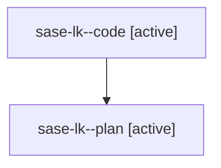

# Family: sase-lk

[Agent Hoods](../README.md) / [bbugyi200](../users/bbugyi200/README.md) / [athena](../users/bbugyi200/machines/athena/README.md) / [sase-lk](../users/bbugyi200/machines/athena/hoods/sase-lk/README.md) / sase-lk

Owner: `bbugyi200.athena` · Hood: `sase-lk` · Members: 2 · Bead: [sase-lk](https://github.com/sase-org/sase--beads/blob/main/pages/sase-lk/README.md)

## Lineage

The diagram is an optional enhancement; the ordered table below contains the same lineage in accessible text.

| Role | Agent | State | Model / provider | Timing | Commits | Prompt | Chat |
|---|---|---|---|---|---:|---|---|
| code | sase-lk--code | active | grok-4.6 / grok | 2026-08-15T21:53:02.834455+00:00 | 0 | — | — |
| plan | sase-lk--plan | active | gpt-5.6-sol / codex | 2026-08-15T21:43:48.092179+00:00 | 0 | [Prompt](../agents/bbugyi200.athena.sase-lk--plan/prompt.md) | [Chat](../agents/bbugyi200.athena.sase-lk--plan/chat.md) |
