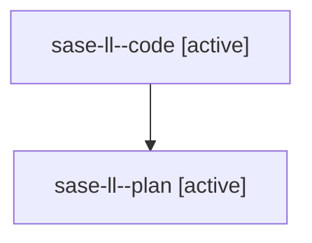

# Family: sase-ll

[Agent Hoods](../README.md) / [bbugyi200](../users/bbugyi200/README.md) / [athena](../users/bbugyi200/machines/athena/README.md) / [sase-ll](../users/bbugyi200/machines/athena/hoods/sase-ll/README.md) / sase-ll

Owner: `bbugyi200.athena` · Hood: `sase-ll` · Members: 2 · Bead: [sase-ll](https://github.com/sase-org/sase--beads/blob/main/pages/sase-ll/README.md)

## Lineage

The diagram is an optional enhancement; the ordered table below contains the same lineage in accessible text.

| Role | Agent | State | Model / provider | Timing | Commits | Prompt | Chat |
|---|---|---|---|---|---:|---|---|
| code | sase-ll--code | active | grok-4.6 / grok | 2026-08-15T19:35:47.618877+00:00 | [1](../agents/bbugyi200.athena.sase-ll--code/README.md#commits) | — | — |
| plan | sase-ll--plan | active | gpt-5.6-sol / codex | 2026-08-15T19:30:41.522148+00:00 | 0 | [Prompt](../agents/bbugyi200.athena.sase-ll--plan/prompt.md) | [Chat](../agents/bbugyi200.athena.sase-ll--plan/chat.md) |

## Commits

| Role | Repo | Commit | Subject | Committed |
|---|---|---|---|---|
| code | sase | [`0b465a3`](https://github.com/sase-org/sase/commit/0b465a39c31d55f64a087123b68ff33ad50a5b04) | fix(monitor): pin implicit starts to the calling agent | 2026-08-15 20:07:07 UTC |
