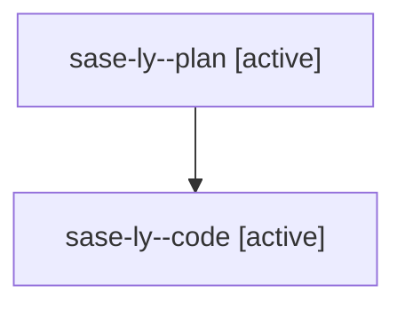

# Family: sase-ly

[Agent Hoods](../README.md) / [bbugyi200](../users/bbugyi200/README.md) / [athena](../users/bbugyi200/machines/athena/README.md) / [sase-ly](../users/bbugyi200/machines/athena/hoods/sase-ly/README.md) / sase-ly

Owner: `bbugyi200.athena` · Hood: `sase-ly` · Members: 2 · Bead: [sase-ly](https://github.com/sase-org/sase--beads/blob/main/pages/sase-ly/README.md)

## Lineage

The diagram is an optional enhancement; the ordered table below contains the same lineage in accessible text.

| Role | Agent | State | Model / provider | Timing | Commits | Prompt | Chat |
|---|---|---|---|---|---:|---|---|
| plan | sase-ly--plan | active | gpt-5.6-sol / codex | 2026-08-14T14:36:27.853750+00:00 | 0 | [Prompt](../agents/bbugyi200.athena.sase-ly--plan/prompt.md) | [Chat](../agents/bbugyi200.athena.sase-ly--plan/chat.md) |
| code | sase-ly--code | active | gpt-5.5 / codex | 2026-08-14T14:43:47.196139+00:00 | [1](../agents/bbugyi200.athena.sase-ly--code/README.md#commits) | — | — |

## Commits

| Role | Repo | Commit | Subject | Committed |
|---|---|---|---|---|
| code | sase | [`21633ba`](https://github.com/sase-org/sase/commit/21633ba1bf044b08bd3bf8dcc4e225e8e81a6d77) | fix: protect dirty work during repo open and finalization | 2026-08-14 15:19:29 UTC |
