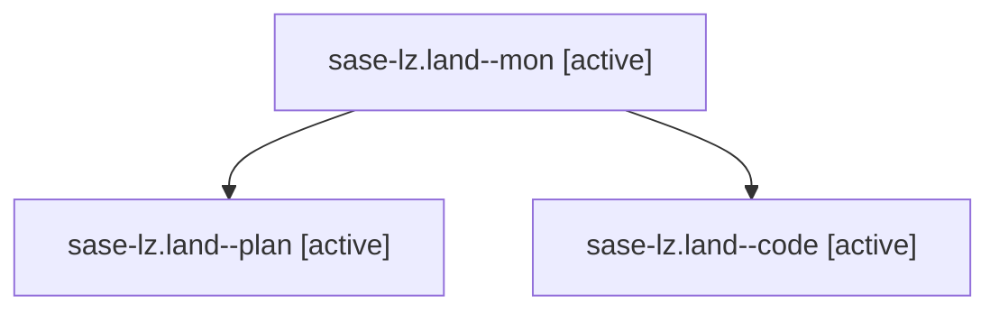

# Family: sase-lz.land

[Agent Hoods](../README.md) / [bbugyi200](../users/bbugyi200/README.md) / [athena](../users/bbugyi200/machines/athena/README.md) / [sase-lz](../users/bbugyi200/machines/athena/hoods/sase-lz/README.md) / sase-lz.land

Owner: `bbugyi200.athena` · Hood: `sase-lz` · Members: 3 · Bead: [sase-lz](https://github.com/sase-org/sase--beads/blob/main/pages/sase-lz/README.md)

## Lineage

The diagram is an optional enhancement; the ordered table below contains the same lineage in accessible text.

| Role | Agent | State | Model / provider | Timing | Commits | Prompt | Chat |
|---|---|---|---|---|---:|---|---|
| mon | sase-lz.land--mon | active | gpt-5.5 / codex | 2026-08-14T17:08:11.437890+00:00 | 0 | — | — |
| plan | sase-lz.land--plan | active | gpt-5.6-sol / codex | 2026-08-14T16:45:42.096876+00:00 | 0 | [Prompt](../agents/bbugyi200.athena.sase-lz.land--plan/prompt.md) | [Chat](../agents/bbugyi200.athena.sase-lz.land--plan/chat.md) |
| code | sase-lz.land--code | active | gpt-5.5 / codex | 2026-08-14T16:56:33.790283+00:00 | [1](../agents/bbugyi200.athena.sase-lz.land--code/README.md#commits) | — | — |

## Commits

| Role | Repo | Commit | Subject | Committed |
|---|---|---|---|---|
| code | sase | [`6ee3347`](https://github.com/sase-org/sase/commit/6ee334708e366715046bc7f871ca66f234794126) | fix(ace): reject typed selectors in builder members | 2026-08-14 13:09:42 EDT |

## Neighbors

| Agent | Relation | State |
|---|---|---|
| [sase-lz.1](../agents/bbugyi200.athena.sase-lz.1/README.md) | sase-lz hood | completed |
| [sase-lz.2](../agents/bbugyi200.athena.sase-lz.2/README.md) | sase-lz hood | completed |
| [sase-lz.3](../agents/bbugyi200.athena.sase-lz.3/README.md) | sase-lz hood | completed |
| [sase-lz.4](../agents/bbugyi200.athena.sase-lz.4/README.md) | sase-lz hood | completed |
