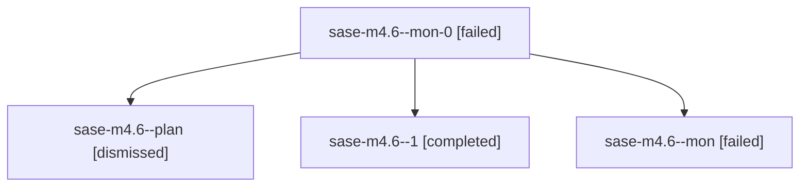

# Family: sase-m4.6

[Agent Hoods](../README.md) / [bbugyi200](../users/bbugyi200/README.md) / [athena](../users/bbugyi200/machines/athena/README.md) / [sase-m4](../users/bbugyi200/machines/athena/hoods/sase-m4/README.md) / sase-m4.6

Owner: `bbugyi200.athena` · Hood: `sase-m4` · Members: 4 · Bead: [sase-m4.6](https://github.com/sase-org/sase--beads/blob/main/pages/sase-m4/sase-m4.6.md)

## Lineage

The diagram is an optional enhancement; the ordered table below contains the same lineage in accessible text.

| Role | Agent | State | Model / provider | Timing | Commits | Prompt | Chat |
|---|---|---|---|---|---:|---|---|
| mon-0 | sase-m4.6--mon-0 | failed | sonnet / claude | 2026-08-14T19:56:54.929877+00:00 | 0 | — | [Chat](../agents/bbugyi200.athena.sase-m4.6--mon-0/chat.md) |
| plan | sase-m4.6--plan | dismissed | sonnet / claude | 2026-08-14T15:14:25.450466 → 2026-08-14T15:40:08.869598 | 0 | — | [Chat](../agents/bbugyi200.athena.sase-m4.6--plan/chat.md) |
| 1 | sase-m4.6--1 | completed | sonnet / claude | 2026-08-14T19:51:01.317494+00:00 | 0 | [Prompt](../agents/bbugyi200.athena.sase-m4.6--1/prompt.md) | [Chat](../agents/bbugyi200.athena.sase-m4.6--1/chat.md) |
| mon | sase-m4.6--mon | failed | sonnet / claude | 2026-08-14T19:40:03.360580+00:00 | 0 | — | [Chat](../agents/bbugyi200.athena.sase-m4.6--mon/chat.md) |

## Neighbors

| Agent | Relation | State |
|---|---|---|
| [sase-m4.1](../agents/bbugyi200.athena.sase-m4.1/README.md) | sase-m4 hood | completed |
| [sase-m4.2](../agents/bbugyi200.athena.sase-m4.2/README.md) | sase-m4 hood | completed |
| [sase-m4.3](../agents/bbugyi200.athena.sase-m4.3/README.md) | sase-m4 hood | completed |
| [sase-m4.4](../agents/bbugyi200.athena.sase-m4.4/README.md) | sase-m4 hood | completed |
| [sase-m4.5](../agents/bbugyi200.athena.sase-m4.5/README.md) | sase-m4 hood | completed |
| [sase-m4.6--2--code](../agents/bbugyi200.athena.sase-m4.6--2--code/README.md) | sase-m4 hood | completed |
| [sase-m4.6--2--plan](../agents/bbugyi200.athena.sase-m4.6--2--plan/README.md) | sase-m4 hood | completed |
| [sase-m4.6\_1](bbugyi200.athena.sase-m4.6_1.md) (family · 3) | sase-m4 hood | completed 2, failed 1 |
| [sase-m4.land](bbugyi200.athena.sase-m4.land.md) (family · 21) | sase-m4 hood | completed 11, failed 10 |
| [sase-m4.land--a--code](../agents/bbugyi200.athena.sase-m4.land--a--code/README.md) | sase-m4 hood | completed |
| [sase-m4.land--a--plan](../agents/bbugyi200.athena.sase-m4.land--a--plan/README.md) | sase-m4 hood | completed |
