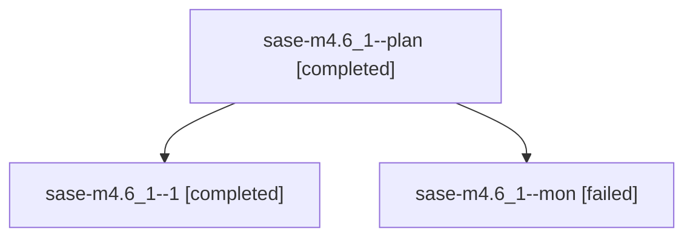

# Family: sase-m4.6\_1

[Agent Hoods](../README.md) / [bbugyi200](../users/bbugyi200/README.md) / [athena](../users/bbugyi200/machines/athena/README.md) / [sase-m4](../users/bbugyi200/machines/athena/hoods/sase-m4/README.md) / sase-m4.6\_1

Owner: `bbugyi200.athena` · Hood: `sase-m4` · Members: 3

## Lineage

The diagram is an optional enhancement; the ordered table below contains the same lineage in accessible text.

| Role | Agent | State | Model / provider | Timing | Commits | Prompt | Chat |
|---|---|---|---|---|---:|---|---|
| plan | sase-m4.6\_1--plan | completed | gpt-5.5 / codex | 2026-08-14T21:12:09.143679+00:00 | 0 | [Prompt](../agents/bbugyi200.athena.sase-m4.6_1--plan/prompt.md) | [Chat](../agents/bbugyi200.athena.sase-m4.6_1--plan/chat.md) |
| 1 | sase-m4.6\_1--1 | completed | gpt-5.5 / codex | 2026-08-14T21:46:20.955632+00:00 | 0 | [Prompt](../agents/bbugyi200.athena.sase-m4.6_1--1/prompt.md) | [Chat](../agents/bbugyi200.athena.sase-m4.6_1--1/chat.md) |
| mon | sase-m4.6\_1--mon | failed | gpt-5.5 / codex | 2026-08-14T21:34:12.723777+00:00 | 0 | — | [Chat](../agents/bbugyi200.athena.sase-m4.6_1--mon/chat.md) |

## Neighbors

| Agent | Relation | State |
|---|---|---|
| [sase-m4.1](../agents/bbugyi200.athena.sase-m4.1/README.md) | sase-m4 hood | completed |
| [sase-m4.2](../agents/bbugyi200.athena.sase-m4.2/README.md) | sase-m4 hood | completed |
| [sase-m4.3](../agents/bbugyi200.athena.sase-m4.3/README.md) | sase-m4 hood | completed |
| [sase-m4.4](../agents/bbugyi200.athena.sase-m4.4/README.md) | sase-m4 hood | completed |
| [sase-m4.5](../agents/bbugyi200.athena.sase-m4.5/README.md) | sase-m4 hood | completed |
| [sase-m4.6](bbugyi200.athena.sase-m4.6.md) (family · 4) | sase-m4 hood | completed 1, dismissed 1, failed 2 |
| [sase-m4.6--2--code](../agents/bbugyi200.athena.sase-m4.6--2--code/README.md) | sase-m4 hood | completed |
| [sase-m4.6--2--plan](../agents/bbugyi200.athena.sase-m4.6--2--plan/README.md) | sase-m4 hood | completed |
| [sase-m4.land](bbugyi200.athena.sase-m4.land.md) (family · 21) | sase-m4 hood | completed 11, failed 10 |
| [sase-m4.land--a--code](../agents/bbugyi200.athena.sase-m4.land--a--code/README.md) | sase-m4 hood | completed |
| [sase-m4.land--a--plan](../agents/bbugyi200.athena.sase-m4.land--a--plan/README.md) | sase-m4 hood | completed |
