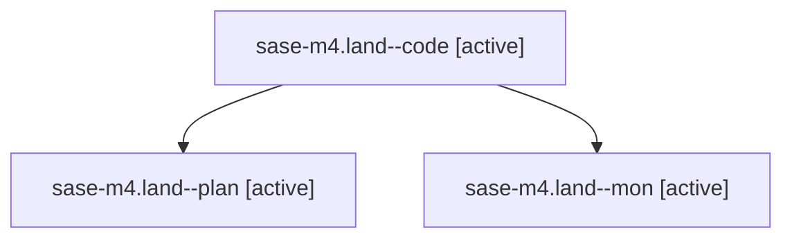

# Family: sase-m4.land

[Agent Hoods](../README.md) / [bbugyi200](../users/bbugyi200/README.md) / [athena](../users/bbugyi200/machines/athena/README.md) / [sase-m4](../users/bbugyi200/machines/athena/hoods/sase-m4/README.md) / sase-m4.land

Owner: `bbugyi200.athena` · Hood: `sase-m4` · Members: 3 · Bead: [sase-m4](https://github.com/sase-org/sase--beads/blob/main/pages/sase-m4/README.md)

## Lineage

The diagram is an optional enhancement; the ordered table below contains the same lineage in accessible text.

| Role | Agent | State | Model / provider | Timing | Commits | Prompt | Chat |
|---|---|---|---|---|---:|---|---|
| code | sase-m4.land--code | active | gpt-5.5 / codex | 2026-08-14T22:08:32.246377+00:00 | [1](../agents/bbugyi200.athena.sase-m4.land--code/README.md#commits) | — | — |
| plan | sase-m4.land--plan | active | opus / claude | 2026-08-14T21:50:49.051405+00:00 | 0 | [Prompt](../agents/bbugyi200.athena.sase-m4.land--plan/prompt.md) | [Chat](../agents/bbugyi200.athena.sase-m4.land--plan/chat.md) |
| mon | sase-m4.land--mon | active | gpt-5.5 / codex | 2026-08-14T22:18:36.270107+00:00 | 0 | — | — |

## Commits

| Role | Repo | Commit | Subject | Committed |
|---|---|---|---|---|
| code | sase | [`5601920`](https://github.com/sase-org/sase/commit/5601920c9dc66259eb858dc7c851e6d4801014a8) | test: stabilize GitHub Actions checks | 2026-08-14 18:20:12 EDT |

## Neighbors

| Agent | Relation | State |
|---|---|---|
| [sase-m4.1](../agents/bbugyi200.athena.sase-m4.1/README.md) | sase-m4 hood | completed |
| [sase-m4.2](../agents/bbugyi200.athena.sase-m4.2/README.md) | sase-m4 hood | completed |
| [sase-m4.3](../agents/bbugyi200.athena.sase-m4.3/README.md) | sase-m4 hood | completed |
| [sase-m4.4](../agents/bbugyi200.athena.sase-m4.4/README.md) | sase-m4 hood | completed |
| [sase-m4.5](../agents/bbugyi200.athena.sase-m4.5/README.md) | sase-m4 hood | completed |
| [sase-m4.6](bbugyi200.athena.sase-m4.6.md) (family · 4) | sase-m4 hood | completed 1, dismissed 1, failed 2 |
| [sase-m4.6--2--code](../agents/bbugyi200.athena.sase-m4.6--2--code/README.md) | sase-m4 hood | completed |
| [sase-m4.6--2--plan](../agents/bbugyi200.athena.sase-m4.6--2--plan/README.md) | sase-m4 hood | completed |
| [sase-m4.6\_1](bbugyi200.athena.sase-m4.6_1.md) (family · 3) | sase-m4 hood | completed 2, failed 1 |
