# Family: sase-m4.land

[Agent Hoods](../README.md) / [bbugyi200](../users/bbugyi200/README.md) / [athena](../users/bbugyi200/machines/athena/README.md) / [sase-m4](../users/bbugyi200/machines/athena/hoods/sase-m4/README.md) / sase-m4.land

Owner: `bbugyi200.athena` · Hood: `sase-m4` · Members: 21 · Bead: [sase-m4](https://github.com/sase-org/sase--beads/blob/main/pages/sase-m4/README.md)

## Lineage

```mermaid
flowchart TD
  n0["sase-m4.land--mon-4 [failed]"]
  n1["sase-m4.land--5 [completed]"]
  n0 --> n1
  n2["sase-m4.land--mon-5 [failed]"]
  n0 --> n2
  n3["sase-m4.land--mon-2 [failed]"]
  n0 --> n3
  n4["sase-m4.land--4 [completed]"]
  n0 --> n4
  n5["sase-m4.land--code [completed]"]
  n0 --> n5
  n6["sase-m4.land--3 [completed]"]
  n0 --> n6
  n7["sase-m4.land--mon-1 [failed]"]
  n0 --> n7
  n8["sase-m4.land--8 [completed]"]
  n0 --> n8
  n9["sase-m4.land--mon-0 [failed]"]
  n0 --> n9
  n10["sase-m4.land--mon-6 [failed]"]
  n0 --> n10
  n11["sase-m4.land--mon-3 [failed]"]
  n0 --> n11
  n12["sase-m4.land--6 [completed]"]
  n0 --> n12
  n13["sase-m4.land--mon-7 [failed]"]
  n0 --> n13
  n14["sase-m4.land--plan [completed]"]
  n0 --> n14
  n15["sase-m4.land--7 [completed]"]
  n0 --> n15
  n16["sase-m4.land--2 [completed]"]
  n0 --> n16
  n17["sase-m4.land--9 [completed]"]
  n0 --> n17
  n18["sase-m4.land--mon [failed]"]
  n0 --> n18
  n19["sase-m4.land--mon-8 [failed]"]
  n0 --> n19
  n20["sase-m4.land--1 [completed]"]
  n0 --> n20
```

The diagram is an optional enhancement; the ordered table below contains the same lineage in accessible text.

| Role | Agent | State | Model / provider | Timing | Commits | Prompt | Chat |
|---|---|---|---|---|---:|---|---|
| mon-4 | sase-m4.land--mon-4 | failed | gpt-5.5 / codex | 2026-08-15T00:29:45.146466+00:00 | 0 | — | [Chat](../agents/bbugyi200.athena.sase-m4.land--mon-4/chat.md) |
| 5 | sase-m4.land--5 | completed | gpt-5.5 / codex | 2026-08-15T00:27:32.064980+00:00 | 0 | [Prompt](../agents/bbugyi200.athena.sase-m4.land--5/prompt.md) | [Chat](../agents/bbugyi200.athena.sase-m4.land--5/chat.md) |
| mon-5 | sase-m4.land--mon-5 | failed | gpt-5.5 / codex | 2026-08-15T01:03:58.622145+00:00 | 0 | — | [Chat](../agents/bbugyi200.athena.sase-m4.land--mon-5/chat.md) |
| mon-2 | sase-m4.land--mon-2 | failed | gpt-5.5 / codex | 2026-08-14T22:50:01.751305+00:00 | 0 | — | [Chat](../agents/bbugyi200.athena.sase-m4.land--mon-2/chat.md) |
| 4 | sase-m4.land--4 | completed | gpt-5.5 / codex | 2026-08-15T00:23:27.342164+00:00 | 0 | [Prompt](../agents/bbugyi200.athena.sase-m4.land--4/prompt.md) | [Chat](../agents/bbugyi200.athena.sase-m4.land--4/chat.md) |
| code | sase-m4.land--code | completed | gpt-5.5 / codex | 2026-08-14T22:08:32.246377+00:00 | [1](../agents/bbugyi200.athena.sase-m4.land--code/README.md#commits) | — | [Chat](../agents/bbugyi200.athena.sase-m4.land--code/chat.md) |
| 3 | sase-m4.land--3 | completed | gpt-5.5 / codex | 2026-08-14T22:48:36.110530+00:00 | 0 | [Prompt](../agents/bbugyi200.athena.sase-m4.land--3/prompt.md) | [Chat](../agents/bbugyi200.athena.sase-m4.land--3/chat.md) |
| mon-1 | sase-m4.land--mon-1 | failed | gpt-5.5 / codex | 2026-08-14T22:47:20.953920+00:00 | 0 | — | [Chat](../agents/bbugyi200.athena.sase-m4.land--mon-1/chat.md) |
| 8 | sase-m4.land--8 | completed | gpt-5.5 / codex | 2026-08-15T02:32:26.288258+00:00 | 0 | [Prompt](../agents/bbugyi200.athena.sase-m4.land--8/prompt.md) | [Chat](../agents/bbugyi200.athena.sase-m4.land--8/chat.md) |
| mon-0 | sase-m4.land--mon-0 | failed | gpt-5.5 / codex | 2026-08-14T22:32:32.415976+00:00 | 0 | — | [Chat](../agents/bbugyi200.athena.sase-m4.land--mon-0/chat.md) |
| mon-6 | sase-m4.land--mon-6 | failed | gpt-5.5 / codex | 2026-08-15T01:19:26.691207+00:00 | 0 | — | [Chat](../agents/bbugyi200.athena.sase-m4.land--mon-6/chat.md) |
| mon-3 | sase-m4.land--mon-3 | failed | gpt-5.5 / codex | 2026-08-15T00:25:58.209532+00:00 | 0 | — | [Chat](../agents/bbugyi200.athena.sase-m4.land--mon-3/chat.md) |
| 6 | sase-m4.land--6 | completed | gpt-5.5 / codex | 2026-08-15T01:02:08.058399+00:00 | 0 | [Prompt](../agents/bbugyi200.athena.sase-m4.land--6/prompt.md) | [Chat](../agents/bbugyi200.athena.sase-m4.land--6/chat.md) |
| mon-7 | sase-m4.land--mon-7 | failed | gpt-5.5 / codex | 2026-08-15T02:34:06.980871+00:00 | 0 | — | [Chat](../agents/bbugyi200.athena.sase-m4.land--mon-7/chat.md) |
| plan | sase-m4.land--plan | completed | opus / claude | 2026-08-14T21:50:49.051405+00:00 | 0 | [Prompt](../agents/bbugyi200.athena.sase-m4.land--plan/prompt.md) | [Chat](../agents/bbugyi200.athena.sase-m4.land--plan/chat.md) |
| 7 | sase-m4.land--7 | completed | gpt-5.5 / codex | 2026-08-15T01:17:45.191927+00:00 | 0 | [Prompt](../agents/bbugyi200.athena.sase-m4.land--7/prompt.md) | [Chat](../agents/bbugyi200.athena.sase-m4.land--7/chat.md) |
| 2 | sase-m4.land--2 | completed | gpt-5.5 / codex | 2026-08-14T22:45:19.518586+00:00 | 0 | [Prompt](../agents/bbugyi200.athena.sase-m4.land--2/prompt.md) | [Chat](../agents/bbugyi200.athena.sase-m4.land--2/chat.md) |
| 9 | sase-m4.land--9 | completed | gpt-5.5 / codex | 2026-08-15T03:35:59.622888+00:00 | 0 | [Prompt](../agents/bbugyi200.athena.sase-m4.land--9/prompt.md) | [Chat](../agents/bbugyi200.athena.sase-m4.land--9/chat.md) |
| mon | sase-m4.land--mon | failed | gpt-5.5 / codex | 2026-08-14T22:18:36.270107+00:00 | 0 | — | [Chat](../agents/bbugyi200.athena.sase-m4.land--mon/chat.md) |
| mon-8 | sase-m4.land--mon-8 | failed | gpt-5.5 / codex | 2026-08-15T03:37:24.988193+00:00 | 0 | — | [Chat](../agents/bbugyi200.athena.sase-m4.land--mon-8/chat.md) |
| 1 | sase-m4.land--1 | completed | gpt-5.5 / codex | 2026-08-14T22:30:12.943655+00:00 | 0 | [Prompt](../agents/bbugyi200.athena.sase-m4.land--1/prompt.md) | [Chat](../agents/bbugyi200.athena.sase-m4.land--1/chat.md) |

## Commits

| Role | Repo | Commit | Subject | Committed |
|---|---|---|---|---|
| code | sase | [`5601920`](https://github.com/sase-org/sase/commit/5601920c9dc66259eb858dc7c851e6d4801014a8) | test: stabilize GitHub Actions checks | 2026-08-14 22:20:12 UTC |

## Neighbors

| Agent | Relation | State |
|---|---|---|
| [sase-m4.1](../agents/bbugyi200.athena.sase-m4.1/README.md) | sase-m4 hood | completed |
| [sase-m4.2](../agents/bbugyi200.athena.sase-m4.2/README.md) | sase-m4 hood | completed |
| [sase-m4.3](../agents/bbugyi200.athena.sase-m4.3/README.md) | sase-m4 hood | completed |
| [sase-m4.4](../agents/bbugyi200.athena.sase-m4.4/README.md) | sase-m4 hood | completed |
| [sase-m4.5](../agents/bbugyi200.athena.sase-m4.5/README.md) | sase-m4 hood | completed |
| [sase-m4.6](bbugyi200.athena.sase-m4.6.md) (family · 4) | sase-m4 hood | completed 1, dismissed 1, failed 2 |
| [sase-m4.6--2--code](../agents/bbugyi200.athena.sase-m4.6--2--code/README.md) | sase-m4 hood | completed |
| [sase-m4.6--2--plan](../agents/bbugyi200.athena.sase-m4.6--2--plan/README.md) | sase-m4 hood | completed |
| [sase-m4.6\_1](bbugyi200.athena.sase-m4.6_1.md) (family · 3) | sase-m4 hood | completed 2, failed 1 |
| [sase-m4.land--a--code](../agents/bbugyi200.athena.sase-m4.land--a--code/README.md) | sase-m4 hood | completed |
| [sase-m4.land--a--plan](../agents/bbugyi200.athena.sase-m4.land--a--plan/README.md) | sase-m4 hood | completed |
