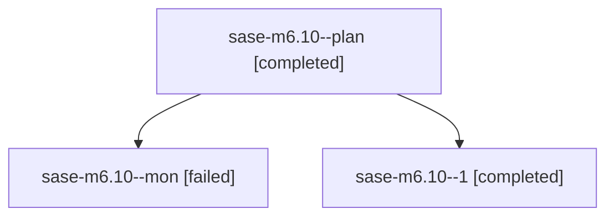

# Family: sase-m6.10

[Agent Hoods](../README.md) / [bbugyi200](../users/bbugyi200/README.md) / [athena](../users/bbugyi200/machines/athena/README.md) / [sase-m6](../users/bbugyi200/machines/athena/hoods/sase-m6/README.md) / sase-m6.10

Owner: `bbugyi200.athena` · Hood: `sase-m6` · Members: 3 · Bead: [sase-m6.10](https://github.com/sase-org/sase--beads/blob/main/pages/sase-m6/sase-m6.10.md)

## Lineage

The diagram is an optional enhancement; the ordered table below contains the same lineage in accessible text.

| Role | Agent | State | Model / provider | Timing | Commits | Prompt | Chat |
|---|---|---|---|---|---:|---|---|
| plan | sase-m6.10--plan | completed | gpt-5.5 / codex | 2026-08-16T20:05:27.195392+00:00 | 0 | [Prompt](../agents/bbugyi200.athena.sase-m6.10--plan/prompt.md) | [Chat](../agents/bbugyi200.athena.sase-m6.10--plan/chat.md) |
| mon | sase-m6.10--mon | failed | gpt-5.5 / codex | 2026-08-16T20:44:46.492201+00:00 | 0 | — | [Chat](../agents/bbugyi200.athena.sase-m6.10--mon/chat.md) |
| 1 | sase-m6.10--1 | completed | gpt-5.5 / codex | 2026-08-16T20:59:14.275705+00:00 | [1](../agents/bbugyi200.athena.sase-m6.10--1/README.md#commits) | [Prompt](../agents/bbugyi200.athena.sase-m6.10--1/prompt.md) | [Chat](../agents/bbugyi200.athena.sase-m6.10--1/chat.md) |

## Commits

| Role | Repo | Commit | Subject | Committed |
|---|---|---|---|---|
| 1 | sase | [`3f5378a`](https://github.com/sase-org/sase/commit/3f5378aebe2490cfc6c88aa266e30c8f1755a212) | feat(artifacts): conform pane contract capabilities | 2026-08-16 17:20:39 EDT |

## Neighbors

| Agent | Relation | State |
|---|---|---|
| [sase-m6.1](../agents/bbugyi200.athena.sase-m6.1/README.md) | sase-m6 hood | completed |
| [sase-m6.2](../agents/bbugyi200.athena.sase-m6.2/README.md) | sase-m6 hood | completed |
| [sase-m6.3](bbugyi200.athena.sase-m6.3.md) (family · 2) | sase-m6 hood | completed 2 |
| [sase-m6.4](bbugyi200.athena.sase-m6.4.md) (family · 4) | sase-m6 hood | completed 3, failed 1 |
| [sase-m6.5](bbugyi200.athena.sase-m6.5.md) (family · 2) | sase-m6 hood | completed 2 |
| [sase-m6.6](bbugyi200.athena.sase-m6.6.md) (family · 2) | sase-m6 hood | failed 2 |
| [sase-m6.6](../agents/bbugyi200.athena.sase-m6.6/README.md) | sase-m6 hood | failed |
| [sase-m6.6.1.1](bbugyi200.athena.sase-m6.6.1.1.md) (family · 5) | sase-m6 hood | completed 3, failed 2 |
| [sase-m6.6.1.2](bbugyi200.athena.sase-m6.6.1.2.md) (family · 2) | sase-m6 hood | completed 2 |
| [sase-m6.6.1.3](../agents/bbugyi200.athena.sase-m6.6.1.3/README.md) | sase-m6 hood | completed |
| [sase-m6.6.1.4](../agents/bbugyi200.athena.sase-m6.6.1.4/README.md) | sase-m6 hood | completed |
| [sase-m6.6.1.5](bbugyi200.athena.sase-m6.6.1.5.md) (family · 4) | sase-m6 hood | completed 1, dismissed 2, failed 1 |
| [sase-m6.6.1.6](bbugyi200.athena.sase-m6.6.1.6.md) (family · 2) | sase-m6 hood | completed 1, dismissed 1 |
| [sase-m6.6.1.7](../agents/bbugyi200.athena.sase-m6.6.1.7/README.md) | sase-m6 hood | dismissed |
| [sase-m6.6.1.land](bbugyi200.athena.sase-m6.6.1.land.md) (family · 2) | sase-m6 hood | completed 1, dismissed 1 |
| [sase-m6.7](bbugyi200.athena.sase-m6.7.md) (family · 2) | sase-m6 hood | failed 2 |
| [sase-m6.7.1.1](../agents/bbugyi200.athena.sase-m6.7.1.1/README.md) | sase-m6 hood | dismissed |
| [sase-m6.7.1.2](bbugyi200.athena.sase-m6.7.1.2.md) (family · 4) | sase-m6 hood | completed 2, dismissed 1, failed 1 |
| [sase-m6.7.1.3](bbugyi200.athena.sase-m6.7.1.3.md) (family · 8) | sase-m6 hood | completed 4, dismissed 1, failed 3 |
| [sase-m6.7.1.4](bbugyi200.athena.sase-m6.7.1.4.md) (family · 3) | sase-m6 hood | completed 1, dismissed 1, failed 1 |
| [sase-m6.7.1.5](bbugyi200.athena.sase-m6.7.1.5.md) (family · 2) | sase-m6 hood | completed 1, dismissed 1 |
| [sase-m6.7.1.6](bbugyi200.athena.sase-m6.7.1.6.md) (family · 3) | sase-m6 hood | dismissed 2, failed 1 |
| [sase-m6.7.1.land](../agents/bbugyi200.athena.sase-m6.7.1.land/README.md) | sase-m6 hood | dismissed |
| [sase-m6.8](bbugyi200.athena.sase-m6.8.md) (family · 2) | sase-m6 hood | completed 2 |
| [sase-m6.8](../agents/bbugyi200.athena.sase-m6.8/README.md) | sase-m6 hood | waiting |
| [sase-m6.9](../agents/bbugyi200.athena.sase-m6.9/README.md) | sase-m6 hood | completed |
| [sase-m6.land](../agents/bbugyi200.athena.sase-m6.land/README.md) | sase-m6 hood | completed |
