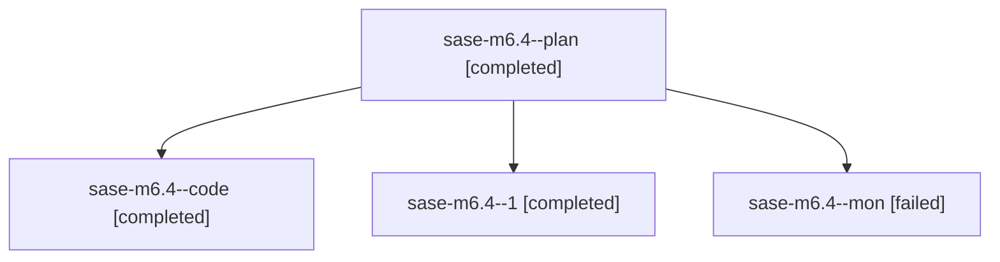

# Family: sase-m6.4

[Agent Hoods](../README.md) / [bbugyi200](../users/bbugyi200/README.md) / [athena](../users/bbugyi200/machines/athena/README.md) / [sase-m6](../users/bbugyi200/machines/athena/hoods/sase-m6/README.md) / sase-m6.4

Owner: `bbugyi200.athena` · Hood: `sase-m6` · Members: 4 · Bead: [sase-m6.4](https://github.com/sase-org/sase--beads/blob/main/pages/sase-m6/sase-m6.4.md)

## Lineage

The diagram is an optional enhancement; the ordered table below contains the same lineage in accessible text.

| Role | Agent | State | Model / provider | Timing | Commits | Prompt | Chat |
|---|---|---|---|---|---:|---|---|
| plan | sase-m6.4--plan | completed | gpt-5.6-sol / codex | 2026-08-14T23:58:00.456964+00:00 | 0 | [Prompt](../agents/bbugyi200.athena.sase-m6.4--plan/prompt.md) | [Chat](../agents/bbugyi200.athena.sase-m6.4--plan/chat.md) |
| code | sase-m6.4--code | completed | grok-4.6 / grok | 2026-08-15T00:04:24.640283+00:00 | 0 | — | [Chat](../agents/bbugyi200.athena.sase-m6.4--code/chat.md) |
| 1 | sase-m6.4--1 | completed | grok-4.6 / grok | 2026-08-15T01:14:23.618021+00:00 | [1](../agents/bbugyi200.athena.sase-m6.4--1/README.md#commits) | [Prompt](../agents/bbugyi200.athena.sase-m6.4--1/prompt.md) | [Chat](../agents/bbugyi200.athena.sase-m6.4--1/chat.md) |
| mon | sase-m6.4--mon | failed | grok-4.6 / grok | 2026-08-15T01:03:11.332182+00:00 | 0 | — | [Chat](../agents/bbugyi200.athena.sase-m6.4--mon/chat.md) |

## Commits

| Role | Repo | Commit | Subject | Committed |
|---|---|---|---|---|
| 1 | sase | [`7060a2e`](https://github.com/sase-org/sase/commit/7060a2ec45dc8a89f6f29b72e9555259103259e7) | feat(tui): drive Artifacts panes from a derived host contract | 2026-08-14 21:17:24 EDT |

## Neighbors

| Agent | Relation | State |
|---|---|---|
| [sase-m6.1](../agents/bbugyi200.athena.sase-m6.1/README.md) | sase-m6 hood | completed |
| [sase-m6.10](../agents/bbugyi200.athena.sase-m6.10/README.md) | sase-m6 hood | waiting |
| [sase-m6.2](../agents/bbugyi200.athena.sase-m6.2/README.md) | sase-m6 hood | completed |
| [sase-m6.3](bbugyi200.athena.sase-m6.3.md) (family · 2) | sase-m6 hood | completed 2 |
| [sase-m6.5](bbugyi200.athena.sase-m6.5.md) (family · 2) | sase-m6 hood | completed 2 |
| [sase-m6.6](bbugyi200.athena.sase-m6.6.md) (family · 2) | sase-m6 hood | failed 2 |
| [sase-m6.6](../agents/bbugyi200.athena.sase-m6.6/README.md) | sase-m6 hood | failed |
| [sase-m6.6.1.1](bbugyi200.athena.sase-m6.6.1.1.md) (family · 5) | sase-m6 hood | active 1, completed 2, failed 2 |
| [sase-m6.6.1.2](../agents/bbugyi200.athena.sase-m6.6.1.2/README.md) | sase-m6 hood | waiting |
| [sase-m6.6.1.3](../agents/bbugyi200.athena.sase-m6.6.1.3/README.md) | sase-m6 hood | waiting |
| [sase-m6.6.1.4](../agents/bbugyi200.athena.sase-m6.6.1.4/README.md) | sase-m6 hood | waiting |
| [sase-m6.6.1.5](../agents/bbugyi200.athena.sase-m6.6.1.5/README.md) | sase-m6 hood | waiting |
| [sase-m6.6.1.6](../agents/bbugyi200.athena.sase-m6.6.1.6/README.md) | sase-m6 hood | waiting |
| [sase-m6.6.1.7](../agents/bbugyi200.athena.sase-m6.6.1.7/README.md) | sase-m6 hood | waiting |
| [sase-m6.6.1.land](../agents/bbugyi200.athena.sase-m6.6.1.land/README.md) | sase-m6 hood | waiting |
| [sase-m6.7](../agents/bbugyi200.athena.sase-m6.7/README.md) | sase-m6 hood | waiting |
| [sase-m6.8](../agents/bbugyi200.athena.sase-m6.8/README.md) | sase-m6 hood | waiting |
| [sase-m6.9](../agents/bbugyi200.athena.sase-m6.9/README.md) | sase-m6 hood | waiting |
| [sase-m6.land](../agents/bbugyi200.athena.sase-m6.land/README.md) | sase-m6 hood | waiting |
