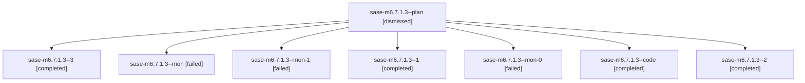

# Family: sase-m6.7.1.3

[Agent Hoods](../README.md) / [bbugyi200](../users/bbugyi200/README.md) / [athena](../users/bbugyi200/machines/athena/README.md) / [sase-m6](../users/bbugyi200/machines/athena/hoods/sase-m6/README.md) / sase-m6.7.1.3

Owner: `bbugyi200.athena` · Hood: `sase-m6` · Members: 8 · Bead: [sase-m6.7.1.3](https://github.com/sase-org/sase--beads/blob/main/pages/sase-m6/sase-m6.7.1.3.md)

## Lineage

The diagram is an optional enhancement; the ordered table below contains the same lineage in accessible text.

| Role | Agent | State | Model / provider | Timing | Commits | Prompt | Chat |
|---|---|---|---|---|---:|---|---|
| plan | sase-m6.7.1.3--plan | dismissed | — | 2026-08-16T02:55:51 | 0 | — | — |
| 3 | sase-m6.7.1.3--3 | completed | opus / claude | 2026-08-16T11:26:41.714618+00:00 | [1](../agents/bbugyi200.athena.sase-m6.7.1.3--3/README.md#commits) | [Prompt](../agents/bbugyi200.athena.sase-m6.7.1.3--3/prompt.md) | [Chat](../agents/bbugyi200.athena.sase-m6.7.1.3--3/chat.md) |
| mon | sase-m6.7.1.3--mon | failed | opus / claude | 2026-08-16T10:54:12.061379+00:00 | 0 | — | [Chat](../agents/bbugyi200.athena.sase-m6.7.1.3--mon/chat.md) |
| mon-1 | sase-m6.7.1.3--mon-1 | failed | opus / claude | 2026-08-16T11:13:36.756298+00:00 | 0 | — | [Chat](../agents/bbugyi200.athena.sase-m6.7.1.3--mon-1/chat.md) |
| 1 | sase-m6.7.1.3--1 | completed | opus / claude | 2026-08-16T11:06:35.534440+00:00 | 0 | [Prompt](../agents/bbugyi200.athena.sase-m6.7.1.3--1/prompt.md) | [Chat](../agents/bbugyi200.athena.sase-m6.7.1.3--1/chat.md) |
| mon-0 | sase-m6.7.1.3--mon-0 | failed | opus / claude | 2026-08-16T11:09:28.963494+00:00 | 0 | — | [Chat](../agents/bbugyi200.athena.sase-m6.7.1.3--mon-0/chat.md) |
| code | sase-m6.7.1.3--code | completed | gpt-5.5 / codex | 2026-08-16T08:47:43.517884+00:00 | 0 | — | [Chat](../agents/bbugyi200.athena.sase-m6.7.1.3--code/chat.md) |
| 2 | sase-m6.7.1.3--2 | completed | opus / claude | 2026-08-16T11:10:03.193023+00:00 | 0 | [Prompt](../agents/bbugyi200.athena.sase-m6.7.1.3--2/prompt.md) | [Chat](../agents/bbugyi200.athena.sase-m6.7.1.3--2/chat.md) |

## Commits

| Role | Repo | Commit | Subject | Committed |
|---|---|---|---|---|
| — | sase | [`a0b6cd1`](https://github.com/sase-org/sase/commit/a0b6cd16bafc0cf4b4c17d760ebdc47e38875f8c) | feat(tui): generalize artifact relation navigation | 2026-08-16 10:58:13 UTC |
| 3 | sase | [`467f8c1`](https://github.com/sase-org/sase/commit/467f8c184e08967805b3faf74ba1995c3307966a) | test: restore two test files reverted by a0b6cd16b | 2026-08-16 11:38:51 UTC |

## Neighbors

| Agent | Relation | State |
|---|---|---|
| [sase-m6.7](bbugyi200.athena.sase-m6.7.md) (family · 2) | ancestor | failed 2 |
| [sase-m6.7.1.1](../agents/bbugyi200.athena.sase-m6.7.1.1/README.md) | sase-m6.7.1 hood | dismissed |
| [sase-m6.7.1.2](bbugyi200.athena.sase-m6.7.1.2.md) (family · 4) | sase-m6.7.1 hood | completed 2, dismissed 1, failed 1 |
| [sase-m6.7.1.4](bbugyi200.athena.sase-m6.7.1.4.md) (family · 3) | sase-m6.7.1 hood | completed 1, dismissed 1, failed 1 |
| [sase-m6.7.1.5](bbugyi200.athena.sase-m6.7.1.5.md) (family · 2) | sase-m6.7.1 hood | completed 1, dismissed 1 |
| [sase-m6.7.1.6](bbugyi200.athena.sase-m6.7.1.6.md) (family · 3) | sase-m6.7.1 hood | dismissed 2, failed 1 |
| [sase-m6.7.1.land](../agents/bbugyi200.athena.sase-m6.7.1.land/README.md) | sase-m6.7.1 hood | dismissed |
| [sase-m6.1](../agents/bbugyi200.athena.sase-m6.1/README.md) | sase-m6 hood | completed |
| [sase-m6.10](bbugyi200.athena.sase-m6.10.md) (family · 3) | sase-m6 hood | completed 2, failed 1 |
| [sase-m6.2](../agents/bbugyi200.athena.sase-m6.2/README.md) | sase-m6 hood | completed |
| [sase-m6.3](bbugyi200.athena.sase-m6.3.md) (family · 2) | sase-m6 hood | completed 2 |
| [sase-m6.4](bbugyi200.athena.sase-m6.4.md) (family · 4) | sase-m6 hood | completed 3, failed 1 |
| [sase-m6.5](bbugyi200.athena.sase-m6.5.md) (family · 2) | sase-m6 hood | completed 2 |
| [sase-m6.6](bbugyi200.athena.sase-m6.6.md) (family · 2) | sase-m6 hood | failed 2 |
| [sase-m6.6](../agents/bbugyi200.athena.sase-m6.6/README.md) | sase-m6 hood | failed |
| [sase-m6.6.1.1](bbugyi200.athena.sase-m6.6.1.1.md) (family · 5) | sase-m6 hood | completed 3, failed 2 |
| [sase-m6.6.1.2](bbugyi200.athena.sase-m6.6.1.2.md) (family · 2) | sase-m6 hood | completed 2 |
| [sase-m6.6.1.3](../agents/bbugyi200.athena.sase-m6.6.1.3/README.md) | sase-m6 hood | completed |
| [sase-m6.6.1.4](../agents/bbugyi200.athena.sase-m6.6.1.4/README.md) | sase-m6 hood | completed |
| [sase-m6.6.1.5](bbugyi200.athena.sase-m6.6.1.5.md) (family · 4) | sase-m6 hood | completed 1, dismissed 2, failed 1 |
| [sase-m6.6.1.6](bbugyi200.athena.sase-m6.6.1.6.md) (family · 2) | sase-m6 hood | completed 1, dismissed 1 |
| [sase-m6.6.1.7](../agents/bbugyi200.athena.sase-m6.6.1.7/README.md) | sase-m6 hood | dismissed |
| [sase-m6.6.1.land](bbugyi200.athena.sase-m6.6.1.land.md) (family · 2) | sase-m6 hood | completed 1, dismissed 1 |
| [sase-m6.8](bbugyi200.athena.sase-m6.8.md) (family · 2) | sase-m6 hood | completed 2 |
| [sase-m6.8](../agents/bbugyi200.athena.sase-m6.8/README.md) | sase-m6 hood | waiting |
| [sase-m6.9](../agents/bbugyi200.athena.sase-m6.9/README.md) | sase-m6 hood | completed |
| [sase-m6.land](../agents/bbugyi200.athena.sase-m6.land/README.md) | sase-m6 hood | completed |
