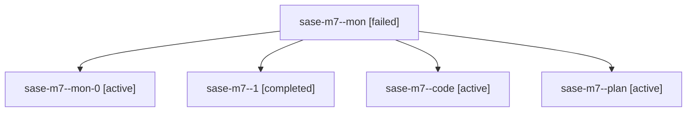

# Family: sase-m7

[Agent Hoods](../README.md) / [bbugyi200](../users/bbugyi200/README.md) / [athena](../users/bbugyi200/machines/athena/README.md) / [sase-m7](../users/bbugyi200/machines/athena/hoods/sase-m7/README.md) / sase-m7

Owner: `bbugyi200.athena` · Hood: `sase-m7` · Members: 5 · Bead: [sase-m7](https://github.com/sase-org/sase--beads/blob/main/pages/sase-m7/README.md)

## Lineage

The diagram is an optional enhancement; the ordered table below contains the same lineage in accessible text.

| Role | Agent | State | Model / provider | Timing | Commits | Prompt | Chat |
|---|---|---|---|---|---:|---|---|
| mon | sase-m7--mon | failed | gpt-5.6-sol / codex | 2026-08-15T21:07:42.852159+00:00 | 0 | — | [Chat](../agents/bbugyi200.athena.sase-m7--mon/chat.md) |
| mon-0 | sase-m7--mon-0 | active | gpt-5.6-sol / codex | 2026-08-15T21:17:24.579615+00:00 | 0 | — | — |
| 1 | sase-m7--1 | completed | gpt-5.6-sol / codex | 2026-08-15T21:15:43.508909+00:00 | 0 | [Prompt](../agents/bbugyi200.athena.sase-m7--1/prompt.md) | [Chat](../agents/bbugyi200.athena.sase-m7--1/chat.md) |
| code | sase-m7--code | active | gpt-5.5 / codex | 2026-08-15T20:18:18.302417+00:00 | [1](../agents/bbugyi200.athena.sase-m7--code/README.md#commits) | — | — |
| plan | sase-m7--plan | active | gpt-5.6-sol / codex | 2026-08-15T20:08:21.229889+00:00 | 0 | [Prompt](../agents/bbugyi200.athena.sase-m7--plan/prompt.md) | [Chat](../agents/bbugyi200.athena.sase-m7--plan/chat.md) |

## Commits

| Role | Repo | Commit | Subject | Committed |
|---|---|---|---|---|
| code | sase | [`2c9f2b7`](https://github.com/sase-org/sase/commit/2c9f2b7fab35576642f50f0c5007494f805174db) | test: isolate tests from ambient color overrides | 2026-08-15 17:16:54 EDT |
