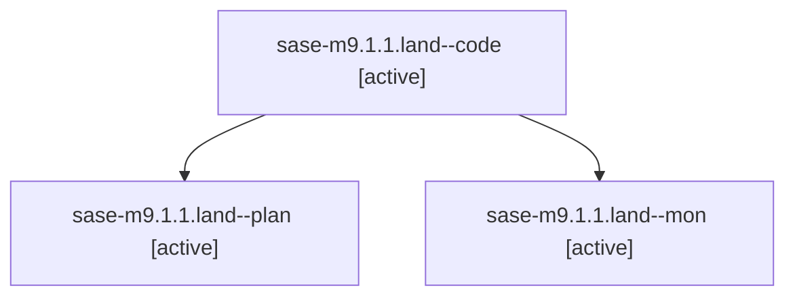

# Family: sase-m9.1.1.land

[Agent Hoods](../README.md) / [bbugyi200](../users/bbugyi200/README.md) / [athena](../users/bbugyi200/machines/athena/README.md) / [sase-m9](../users/bbugyi200/machines/athena/hoods/sase-m9/README.md) / sase-m9.1.1.land

Owner: `bbugyi200.athena` · Hood: `sase-m9` · Members: 3 · Bead: [sase-m9.1.1](https://github.com/sase-org/sase--beads/blob/main/pages/sase-m9/sase-m9.1.1.md)

## Lineage

The diagram is an optional enhancement; the ordered table below contains the same lineage in accessible text.

| Role | Agent | State | Model / provider | Timing | Commits | Prompt | Chat |
|---|---|---|---|---|---:|---|---|
| code | sase-m9.1.1.land--code | active | gpt-5.5 / codex | 2026-08-15T01:15:30.170625+00:00 | [1](../agents/bbugyi200.athena.sase-m9.1.1.land--code/README.md#commits) | — | — |
| plan | sase-m9.1.1.land--plan | active | gpt-5.6-sol / codex | 2026-08-15T01:03:31.551326+00:00 | 0 | [Prompt](../agents/bbugyi200.athena.sase-m9.1.1.land--plan/prompt.md) | [Chat](../agents/bbugyi200.athena.sase-m9.1.1.land--plan/chat.md) |
| mon | sase-m9.1.1.land--mon | active | gpt-5.5 / codex | 2026-08-15T01:34:58.286216+00:00 | 0 | — | — |

## Commits

| Role | Repo | Commit | Subject | Committed |
|---|---|---|---|---|
| code | sase | [`76356cf`](https://github.com/sase-org/sase/commit/76356cf57d71e7574350f003f15caea0f50d9c0d) | docs: align shell taxonomy wording | 2026-08-14 21:36:53 EDT |

## Neighbors

| Agent | Relation | State |
|---|---|---|
| [sase-m9.1](bbugyi200.athena.sase-m9.1.md) (family · 2) | ancestor | failed 2 |
| [sase-m9.1.1.1](../agents/bbugyi200.athena.sase-m9.1.1.1/README.md) | sase-m9.1.1 hood | completed |
| [sase-m9.1.1.2](../agents/bbugyi200.athena.sase-m9.1.1.2/README.md) | sase-m9.1.1 hood | completed |
| [sase-m9.1.1.3](../agents/bbugyi200.athena.sase-m9.1.1.3/README.md) | sase-m9.1.1 hood | completed |
| [sase-m9.2](../agents/bbugyi200.athena.sase-m9.2/README.md) | sase-m9 hood | active |
| [sase-m9.3](../agents/bbugyi200.athena.sase-m9.3/README.md) | sase-m9 hood | waiting |
| [sase-m9.land](../agents/bbugyi200.athena.sase-m9.land/README.md) | sase-m9 hood | waiting |
