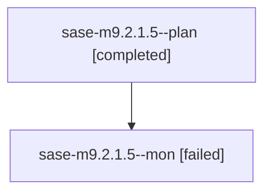

# Family: sase-m9.2.1.5

[Agent Hoods](../README.md) / [bbugyi200](../users/bbugyi200/README.md) / [athena](../users/bbugyi200/machines/athena/README.md) / [sase-m9](../users/bbugyi200/machines/athena/hoods/sase-m9/README.md) / sase-m9.2.1.5

Owner: `bbugyi200.athena` · Hood: `sase-m9` · Members: 2 · Bead: [sase-m9.2.1.5](https://github.com/sase-org/sase--beads/blob/main/pages/sase-m9/sase-m9.2.1.5.md)

## Lineage

The diagram is an optional enhancement; the ordered table below contains the same lineage in accessible text.

| Role | Agent | State | Model / provider | Timing | Commits | Prompt | Chat |
|---|---|---|---|---|---:|---|---|
| plan | sase-m9.2.1.5--plan | completed | gpt-5.5 / codex | 2026-08-15T13:27:12.248399+00:00 | 0 | [Prompt](../agents/bbugyi200.athena.sase-m9.2.1.5--plan/prompt.md) | [Chat](../agents/bbugyi200.athena.sase-m9.2.1.5--plan/chat.md) |
| mon | sase-m9.2.1.5--mon | failed | gpt-5.5 / codex | 2026-08-15T13:53:27.158863+00:00 | 0 | — | [Chat](../agents/bbugyi200.athena.sase-m9.2.1.5--mon/chat.md) |

## Neighbors

| Agent | Relation | State |
|---|---|---|
| [sase-m9.2](../agents/bbugyi200.athena.sase-m9.2/README.md) | ancestor | active |
| [sase-m9.2.1.1](../agents/bbugyi200.athena.sase-m9.2.1.1/README.md) | sase-m9.2.1 hood | completed |
| [sase-m9.2.1.2](../agents/bbugyi200.athena.sase-m9.2.1.2/README.md) | sase-m9.2.1 hood | completed |
| [sase-m9.2.1.3](../agents/bbugyi200.athena.sase-m9.2.1.3/README.md) | sase-m9.2.1 hood | completed |
| [sase-m9.2.1.4](../agents/bbugyi200.athena.sase-m9.2.1.4/README.md) | sase-m9.2.1 hood | completed |
| [sase-m9.2.1.land](../agents/bbugyi200.athena.sase-m9.2.1.land/README.md) | sase-m9.2.1 hood | waiting |
| [sase-m9.1](bbugyi200.athena.sase-m9.1.md) (family · 2) | sase-m9 hood | failed 2 |
| [sase-m9.1.1.1](../agents/bbugyi200.athena.sase-m9.1.1.1/README.md) | sase-m9 hood | completed |
| [sase-m9.1.1.2](../agents/bbugyi200.athena.sase-m9.1.1.2/README.md) | sase-m9 hood | completed |
| [sase-m9.1.1.3](../agents/bbugyi200.athena.sase-m9.1.1.3/README.md) | sase-m9 hood | completed |
| [sase-m9.1.1.land](bbugyi200.athena.sase-m9.1.1.land.md) (family · 6) | sase-m9 hood | completed 4, failed 2 |
| [sase-m9.3](../agents/bbugyi200.athena.sase-m9.3/README.md) | sase-m9 hood | waiting |
| [sase-m9.land](../agents/bbugyi200.athena.sase-m9.land/README.md) | sase-m9 hood | waiting |
