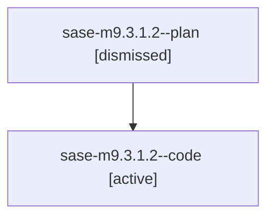

# Family: sase-m9.3.1.2

[Agent Hoods](../README.md) / [bbugyi200](../users/bbugyi200/README.md) / [athena](../users/bbugyi200/machines/athena/README.md) / [sase-m9](../users/bbugyi200/machines/athena/hoods/sase-m9/README.md) / sase-m9.3.1.2

Owner: `bbugyi200.athena` · Hood: `sase-m9` · Members: 2 · Bead: [sase-m9.3.1.2](https://github.com/sase-org/sase--beads/blob/main/pages/sase-m9/sase-m9.3.1.2.md)

## Lineage

The diagram is an optional enhancement; the ordered table below contains the same lineage in accessible text.

| Role | Agent | State | Model / provider | Timing | Commits | Prompt | Chat |
|---|---|---|---|---|---:|---|---|
| plan | sase-m9.3.1.2--plan | dismissed | gpt-5.6-sol / codex | 2026-08-15T16:44:24.300070 → 2026-08-15T18:43:42.918789 | 0 | — | — |
| code | sase-m9.3.1.2--code | active | grok-4.6 / grok | 2026-08-15T20:48:15.549980+00:00 | [1](../agents/bbugyi200.athena.sase-m9.3.1.2--code/README.md#commits) | — | — |

## Commits

| Role | Repo | Commit | Subject | Committed |
|---|---|---|---|---|
| code | sase | [`0835b38`](https://github.com/sase-org/sase/commit/0835b38d24fb0316d23e664b2d3d7a0ee079c49c) | feat(ace): migrate Patch and agent producers to durable argv | 2026-08-15 18:40:26 EDT |

## Neighbors

| Agent | Relation | State |
|---|---|---|
| [sase-m9.3](bbugyi200.athena.sase-m9.3.md) (family · 2) | ancestor | failed 2 |
| [sase-m9.3.1.1](bbugyi200.athena.sase-m9.3.1.1.md) (family · 2) | sase-m9.3.1 hood | completed 2 |
| [sase-m9.3.1.3](bbugyi200.athena.sase-m9.3.1.3.md) (family · 2) | sase-m9.3.1 hood | completed 2 |
| [sase-m9.3.1.3](../agents/bbugyi200.athena.sase-m9.3.1.3/README.md) | sase-m9.3.1 hood | waiting |
| [sase-m9.3.1.4](bbugyi200.athena.sase-m9.3.1.4.md) (family · 2) | sase-m9.3.1 hood | active 1, dismissed 1 |
| [sase-m9.3.1.4](../agents/bbugyi200.athena.sase-m9.3.1.4/README.md) | sase-m9.3.1 hood | waiting |
| [sase-m9.3.1.5](bbugyi200.athena.sase-m9.3.1.5.md) (family · 2) | sase-m9.3.1 hood | completed 2 |
| [sase-m9.3.1.land](../agents/bbugyi200.athena.sase-m9.3.1.land/README.md) | sase-m9.3.1 hood | active |
| [sase-m9.1](bbugyi200.athena.sase-m9.1.md) (family · 2) | sase-m9 hood | failed 2 |
| [sase-m9.1.1.1](../agents/bbugyi200.athena.sase-m9.1.1.1/README.md) | sase-m9 hood | dismissed |
| [sase-m9.1.1.2](../agents/bbugyi200.athena.sase-m9.1.1.2/README.md) | sase-m9 hood | dismissed |
| [sase-m9.1.1.3](../agents/bbugyi200.athena.sase-m9.1.1.3/README.md) | sase-m9 hood | dismissed |
| [sase-m9.1.1.land](bbugyi200.athena.sase-m9.1.1.land.md) (family · 6) | sase-m9 hood | completed 3, dismissed 1, failed 2 |
| [sase-m9.2](bbugyi200.athena.sase-m9.2.md) (family · 2) | sase-m9 hood | failed 2 |
| [sase-m9.2](../agents/bbugyi200.athena.sase-m9.2/README.md) | sase-m9 hood | active |
| [sase-m9.2.1.1](../agents/bbugyi200.athena.sase-m9.2.1.1/README.md) | sase-m9 hood | dismissed |
| [sase-m9.2.1.2](../agents/bbugyi200.athena.sase-m9.2.1.2/README.md) | sase-m9 hood | dismissed |
| [sase-m9.2.1.3](../agents/bbugyi200.athena.sase-m9.2.1.3/README.md) | sase-m9 hood | dismissed |
| [sase-m9.2.1.4](../agents/bbugyi200.athena.sase-m9.2.1.4/README.md) | sase-m9 hood | dismissed |
| [sase-m9.2.1.5](bbugyi200.athena.sase-m9.2.1.5.md) (family · 3) | sase-m9 hood | completed 1, dismissed 1, failed 1 |
| [sase-m9.2.1.6.1](../agents/bbugyi200.athena.sase-m9.2.1.6.1/README.md) | sase-m9 hood | dismissed |
| [sase-m9.2.1.6.2](../agents/bbugyi200.athena.sase-m9.2.1.6.2/README.md) | sase-m9 hood | dismissed |
| [sase-m9.2.1.6.3](bbugyi200.athena.sase-m9.2.1.6.3.md) (family · 3) | sase-m9 hood | completed 1, dismissed 1, failed 1 |
| [sase-m9.2.1.6.land](bbugyi200.athena.sase-m9.2.1.6.land.md) (family · 6) | sase-m9 hood | completed 3, dismissed 1, failed 2 |
| [sase-m9.2.1.land](bbugyi200.athena.sase-m9.2.1.land.md) (family · 2) | sase-m9 hood | dismissed 1, failed 1 |
| [sase-m9.land](../agents/bbugyi200.athena.sase-m9.land/README.md) | sase-m9 hood | waiting |
