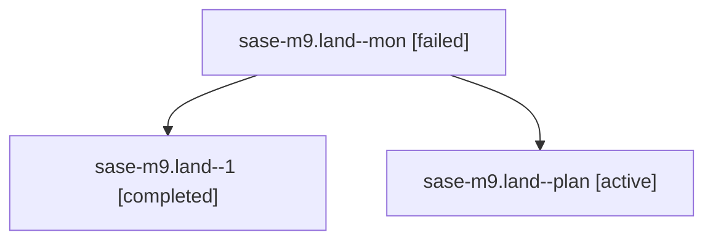

# Family: sase-m9.land

[Agent Hoods](../README.md) / [bbugyi200](../users/bbugyi200/README.md) / [athena](../users/bbugyi200/machines/athena/README.md) / [sase-m9](../users/bbugyi200/machines/athena/hoods/sase-m9/README.md) / sase-m9.land

Owner: `bbugyi200.athena` · Hood: `sase-m9` · Members: 3 · Bead: [sase-m9](https://github.com/sase-org/sase--beads/blob/main/pages/sase-m9/README.md)

## Lineage

The diagram is an optional enhancement; the ordered table below contains the same lineage in accessible text.

| Role | Agent | State | Model / provider | Timing | Commits | Prompt | Chat |
|---|---|---|---|---|---:|---|---|
| mon | sase-m9.land--mon | failed | opus / claude | 2026-08-16T18:54:55.945487+00:00 | 0 | — | [Chat](../agents/bbugyi200.athena.sase-m9.land--mon/chat.md) |
| 1 | sase-m9.land--1 | completed | opus / claude | 2026-08-16T19:03:44.371484+00:00 | 0 | [Prompt](../agents/bbugyi200.athena.sase-m9.land--1/prompt.md) | [Chat](../agents/bbugyi200.athena.sase-m9.land--1/chat.md) |
| plan | sase-m9.land--plan | active | opus / claude | 2026-08-16T18:13:37.944216+00:00 | [1](../agents/bbugyi200.athena.sase-m9.land--plan/README.md#commits) | [Prompt](../agents/bbugyi200.athena.sase-m9.land--plan/prompt.md) | [Chat](../agents/bbugyi200.athena.sase-m9.land--plan/chat.md) |

## Commits

| Role | Repo | Commit | Subject | Committed |
|---|---|---|---|---|
| plan | sase | [`ccbcb35`](https://github.com/sase-org/sase/commit/ccbcb3557e48cdc2cab9c5b70bec05bebcb0652d) | perf(monitor): share one proc-store snapshot per lane scan | 2026-08-16 14:44:29 EDT |

## Neighbors

| Agent | Relation | State |
|---|---|---|
| [sase-m9.1](bbugyi200.athena.sase-m9.1.md) (family · 2) | sase-m9 hood | active 1, failed 1 |
| [sase-m9.1.1.1](../agents/bbugyi200.athena.sase-m9.1.1.1/README.md) | sase-m9 hood | active |
| [sase-m9.1.1.2](../agents/bbugyi200.athena.sase-m9.1.1.2/README.md) | sase-m9 hood | active |
| [sase-m9.1.1.3](../agents/bbugyi200.athena.sase-m9.1.1.3/README.md) | sase-m9 hood | active |
| [sase-m9.1.1.land](bbugyi200.athena.sase-m9.1.1.land.md) (family · 6) | sase-m9 hood | active 1, completed 3, failed 2 |
| [sase-m9.2](bbugyi200.athena.sase-m9.2.md) (family · 2) | sase-m9 hood | active 1, failed 1 |
| [sase-m9.2](../agents/bbugyi200.athena.sase-m9.2/README.md) | sase-m9 hood | active |
| [sase-m9.2.1.1](../agents/bbugyi200.athena.sase-m9.2.1.1/README.md) | sase-m9 hood | active |
| [sase-m9.2.1.2](../agents/bbugyi200.athena.sase-m9.2.1.2/README.md) | sase-m9 hood | active |
| [sase-m9.2.1.3](../agents/bbugyi200.athena.sase-m9.2.1.3/README.md) | sase-m9 hood | active |
| [sase-m9.2.1.4](../agents/bbugyi200.athena.sase-m9.2.1.4/README.md) | sase-m9 hood | active |
| [sase-m9.2.1.5](bbugyi200.athena.sase-m9.2.1.5.md) (family · 3) | sase-m9 hood | active 1, completed 1, failed 1 |
| [sase-m9.2.1.6.1](../agents/bbugyi200.athena.sase-m9.2.1.6.1/README.md) | sase-m9 hood | active |
| [sase-m9.2.1.6.2](../agents/bbugyi200.athena.sase-m9.2.1.6.2/README.md) | sase-m9 hood | active |
| [sase-m9.2.1.6.3](bbugyi200.athena.sase-m9.2.1.6.3.md) (family · 3) | sase-m9 hood | active 1, completed 1, failed 1 |
| [sase-m9.2.1.6.land](bbugyi200.athena.sase-m9.2.1.6.land.md) (family · 6) | sase-m9 hood | active 1, completed 3, failed 2 |
| [sase-m9.2.1.land](bbugyi200.athena.sase-m9.2.1.land.md) (family · 2) | sase-m9 hood | active 1, failed 1 |
| [sase-m9.3](bbugyi200.athena.sase-m9.3.md) (family · 2) | sase-m9 hood | active 1, failed 1 |
| [sase-m9.3.1.1](bbugyi200.athena.sase-m9.3.1.1.md) (family · 2) | sase-m9 hood | active 1, completed 1 |
| [sase-m9.3.1.2](bbugyi200.athena.sase-m9.3.1.2.md) (family · 2) | sase-m9 hood | active 2 |
| [sase-m9.3.1.3](bbugyi200.athena.sase-m9.3.1.3.md) (family · 2) | sase-m9 hood | active 1, completed 1 |
| [sase-m9.3.1.3](../agents/bbugyi200.athena.sase-m9.3.1.3/README.md) | sase-m9 hood | waiting |
| [sase-m9.3.1.4](bbugyi200.athena.sase-m9.3.1.4.md) (family · 2) | sase-m9 hood | active 2 |
| [sase-m9.3.1.4](../agents/bbugyi200.athena.sase-m9.3.1.4/README.md) | sase-m9 hood | waiting |
| [sase-m9.3.1.5](bbugyi200.athena.sase-m9.3.1.5.md) (family · 2) | sase-m9 hood | active 1, completed 1 |
| [sase-m9.3.1.land](../agents/bbugyi200.athena.sase-m9.3.1.land/README.md) | sase-m9 hood | active |
