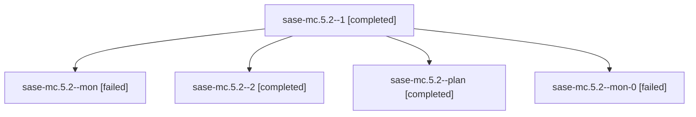

# Family: sase-mc.5.2

[Agent Hoods](../README.md) / [bbugyi200](../users/bbugyi200/README.md) / [athena](../users/bbugyi200/machines/athena/README.md) / [sase-mc](../users/bbugyi200/machines/athena/hoods/sase-mc/README.md) / sase-mc.5.2

Owner: `bbugyi200.athena` · Hood: `sase-mc` · Members: 5 · Bead: [sase-mc.5.2](https://github.com/sase-org/sase--beads/blob/main/pages/sase-mc/sase-mc.5.2.md)

## Lineage

The diagram is an optional enhancement; the ordered table below contains the same lineage in accessible text.

| Role | Agent | State | Model / provider | Timing | Commits | Prompt | Chat |
|---|---|---|---|---|---:|---|---|
| 1 | sase-mc.5.2--1 | completed | gpt-5.5 / codex | 2026-08-15T21:47:05.935842+00:00 | 0 | [Prompt](../agents/bbugyi200.athena.sase-mc.5.2--1/prompt.md) | [Chat](../agents/bbugyi200.athena.sase-mc.5.2--1/chat.md) |
| mon | sase-mc.5.2--mon | failed | gpt-5.5 / codex | 2026-08-15T21:32:15.830641+00:00 | 0 | — | [Chat](../agents/bbugyi200.athena.sase-mc.5.2--mon/chat.md) |
| 2 | sase-mc.5.2--2 | completed | gpt-5.5 / codex | 2026-08-15T22:11:31.893614+00:00 | 0 | [Prompt](../agents/bbugyi200.athena.sase-mc.5.2--2/prompt.md) | [Chat](../agents/bbugyi200.athena.sase-mc.5.2--2/chat.md) |
| plan | sase-mc.5.2--plan | completed | gpt-5.5 / codex | 2026-08-15T20:58:22.210137+00:00 | [1](../agents/bbugyi200.athena.sase-mc.5.2--plan/README.md#commits) | [Prompt](../agents/bbugyi200.athena.sase-mc.5.2--plan/prompt.md) | [Chat](../agents/bbugyi200.athena.sase-mc.5.2--plan/chat.md) |
| mon-0 | sase-mc.5.2--mon-0 | failed | gpt-5.5 / codex | 2026-08-15T21:55:11.217011+00:00 | 0 | — | [Chat](../agents/bbugyi200.athena.sase-mc.5.2--mon-0/chat.md) |

## Commits

| Role | Repo | Commit | Subject | Committed |
|---|---|---|---|---|
| plan | sase | [`6841e29`](https://github.com/sase-org/sase/commit/6841e296fc7063142ec6afc42941020c6831fb72) | test: cover provider disable completion flows | 2026-08-15 21:33:52 UTC |

## Neighbors

| Agent | Relation | State |
|---|---|---|
| [sase-mc.5.1](../agents/bbugyi200.athena.sase-mc.5.1/README.md) | sase-mc.5 hood | completed |
| [sase-mc.5.land](bbugyi200.athena.sase-mc.5.land.md) (family · 2) | sase-mc.5 hood | active 2 |
| [sase-mc.1](../agents/bbugyi200.athena.sase-mc.1/README.md) | sase-mc hood | completed |
| [sase-mc.2](../agents/bbugyi200.athena.sase-mc.2/README.md) | sase-mc hood | completed |
| [sase-mc.3](../agents/bbugyi200.athena.sase-mc.3/README.md) | sase-mc hood | completed |
| [sase-mc.4](../agents/bbugyi200.athena.sase-mc.4/README.md) | sase-mc hood | completed |
| [sase-mc.land](bbugyi200.athena.sase-mc.land.md) (family · 2) | sase-mc hood | failed 2 |
