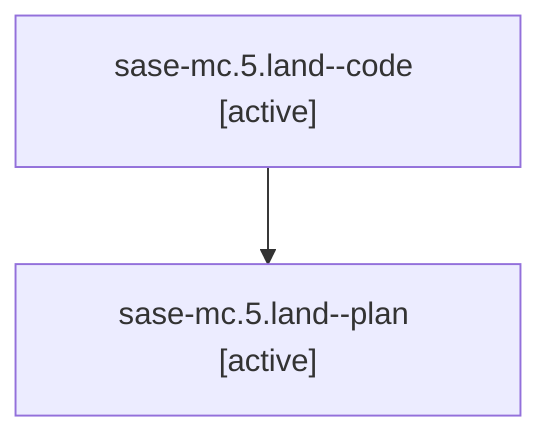

# Family: sase-mc.5.land

[Agent Hoods](../README.md) / [bbugyi200](../users/bbugyi200/README.md) / [athena](../users/bbugyi200/machines/athena/README.md) / [sase-mc](../users/bbugyi200/machines/athena/hoods/sase-mc/README.md) / sase-mc.5.land

Owner: `bbugyi200.athena` · Hood: `sase-mc` · Members: 2 · Bead: [sase-mc.5](https://github.com/sase-org/sase--beads/blob/main/pages/sase-mc/sase-mc.5.md)

## Lineage

The diagram is an optional enhancement; the ordered table below contains the same lineage in accessible text.

| Role | Agent | State | Model / provider | Timing | Commits | Prompt | Chat |
|---|---|---|---|---|---:|---|---|
| code | sase-mc.5.land--code | active | grok-4.6 / grok | 2026-08-15T22:32:02.662003+00:00 | [1](../agents/bbugyi200.athena.sase-mc.5.land--code/README.md#commits) | — | — |
| plan | sase-mc.5.land--plan | active | gpt-5.6-sol / codex | 2026-08-15T22:14:33.898179+00:00 | 0 | [Prompt](../agents/bbugyi200.athena.sase-mc.5.land--plan/prompt.md) | [Chat](../agents/bbugyi200.athena.sase-mc.5.land--plan/chat.md) |

## Commits

| Role | Repo | Commit | Subject | Committed |
|---|---|---|---|---|
| code | sase | [`5511f04`](https://github.com/sase-org/sase/commit/5511f04ed37e0545984957e17e52247cc3fa3256) | fix(tui): keep Models selection across provider snapshots | 2026-08-15 22:51:27 UTC |

## Neighbors

| Agent | Relation | State |
|---|---|---|
| [sase-mc.5.1](../agents/bbugyi200.athena.sase-mc.5.1/README.md) | sase-mc.5 hood | completed |
| [sase-mc.5.2](bbugyi200.athena.sase-mc.5.2.md) (family · 5) | sase-mc.5 hood | completed 3, failed 2 |
| [sase-mc.1](../agents/bbugyi200.athena.sase-mc.1/README.md) | sase-mc hood | completed |
| [sase-mc.2](../agents/bbugyi200.athena.sase-mc.2/README.md) | sase-mc hood | completed |
| [sase-mc.3](../agents/bbugyi200.athena.sase-mc.3/README.md) | sase-mc hood | completed |
| [sase-mc.4](../agents/bbugyi200.athena.sase-mc.4/README.md) | sase-mc hood | completed |
| [sase-mc.land](bbugyi200.athena.sase-mc.land.md) (family · 2) | sase-mc hood | failed 2 |
