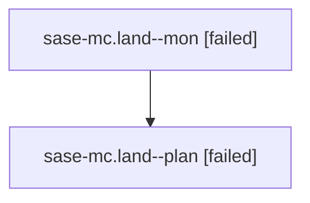

# Family: sase-mc.land

[Agent Hoods](../README.md) / [bbugyi200](../users/bbugyi200/README.md) / [athena](../users/bbugyi200/machines/athena/README.md) / [sase-mc](../users/bbugyi200/machines/athena/hoods/sase-mc/README.md) / sase-mc.land

Owner: `bbugyi200.athena` · Hood: `sase-mc` · Members: 2 · Bead: [sase-mc](https://github.com/sase-org/sase--beads/blob/main/pages/sase-mc/README.md)

## Lineage

The diagram is an optional enhancement; the ordered table below contains the same lineage in accessible text.

| Role | Agent | State | Model / provider | Timing | Commits | Prompt | Chat |
|---|---|---|---|---|---:|---|---|
| mon | sase-mc.land--mon | failed | gpt-5.6-sol / codex | 2026-08-15T20:11:41.512774+00:00 | 0 | — | [Chat](../agents/bbugyi200.athena.sase-mc.land--mon/chat.md) |
| plan | sase-mc.land--plan | failed | gpt-5.6-sol / codex | 2026-08-15T19:45:30.262091+00:00 | 0 | [Prompt](../agents/bbugyi200.athena.sase-mc.land--plan/prompt.md) | [Chat](../agents/bbugyi200.athena.sase-mc.land--plan/chat.md) |

## Neighbors

| Agent | Relation | State |
|---|---|---|
| [sase-mc.1](../agents/bbugyi200.athena.sase-mc.1/README.md) | sase-mc hood | completed |
| [sase-mc.2](../agents/bbugyi200.athena.sase-mc.2/README.md) | sase-mc hood | completed |
| [sase-mc.3](../agents/bbugyi200.athena.sase-mc.3/README.md) | sase-mc hood | completed |
| [sase-mc.4](../agents/bbugyi200.athena.sase-mc.4/README.md) | sase-mc hood | completed |
| [sase-mc.5.1](../agents/bbugyi200.athena.sase-mc.5.1/README.md) | sase-mc hood | active |
| [sase-mc.5.2](../agents/bbugyi200.athena.sase-mc.5.2/README.md) | sase-mc hood | waiting |
| [sase-mc.5.land](../agents/bbugyi200.athena.sase-mc.5.land/README.md) | sase-mc hood | waiting |
