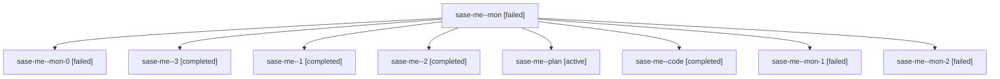

# Family: sase-me

[Agent Hoods](../README.md) / [bbugyi200](../users/bbugyi200/README.md) / [athena](../users/bbugyi200/machines/athena/README.md) / [sase-me](../users/bbugyi200/machines/athena/hoods/sase-me/README.md) / sase-me

Owner: `bbugyi200.athena` · Hood: `sase-me` · Members: 9 · Bead: [sase-me](https://github.com/sase-org/sase--beads/blob/main/pages/sase-me/README.md)

## Lineage

The diagram is an optional enhancement; the ordered table below contains the same lineage in accessible text.

| Role | Agent | State | Model / provider | Timing | Commits | Prompt | Chat |
|---|---|---|---|---|---:|---|---|
| mon | sase-me--mon | failed | gpt-5.6-sol / codex | 2026-08-15T22:21:04.074132+00:00 | 0 | — | [Chat](../agents/bbugyi200.athena.sase-me--mon/chat.md) |
| mon-0 | sase-me--mon-0 | failed | gpt-5.6-sol / codex | 2026-08-15T22:47:46.125157+00:00 | 0 | — | [Chat](../agents/bbugyi200.athena.sase-me--mon-0/chat.md) |
| 3 | sase-me--3 | completed | gpt-5.6-sol / codex | 2026-08-15T23:53:38.908081+00:00 | 0 | [Prompt](../agents/bbugyi200.athena.sase-me--3/prompt.md) | [Chat](../agents/bbugyi200.athena.sase-me--3/chat.md) |
| 1 | sase-me--1 | completed | gpt-5.6-sol / codex | 2026-08-15T22:35:49.656790+00:00 | 0 | [Prompt](../agents/bbugyi200.athena.sase-me--1/prompt.md) | [Chat](../agents/bbugyi200.athena.sase-me--1/chat.md) |
| 2 | sase-me--2 | completed | gpt-5.6-sol / codex | 2026-08-15T22:49:55.339558+00:00 | 0 | [Prompt](../agents/bbugyi200.athena.sase-me--2/prompt.md) | [Chat](../agents/bbugyi200.athena.sase-me--2/chat.md) |
| plan | sase-me--plan | active | gpt-5.6-sol / codex | 2026-08-15T21:44:54.843716+00:00 | 0 | [Prompt](../agents/bbugyi200.athena.sase-me--plan/prompt.md) | [Chat](../agents/bbugyi200.athena.sase-me--plan/chat.md) |
| code | sase-me--code | completed | gpt-5.5 / codex | 2026-08-15T21:53:32.028442+00:00 | [1](../agents/bbugyi200.athena.sase-me--code/README.md#commits) | — | [Chat](../agents/bbugyi200.athena.sase-me--code/chat.md) |
| mon-1 | sase-me--mon-1 | failed | gpt-5.6-sol / codex | 2026-08-15T22:53:08.619494+00:00 | 0 | — | [Chat](../agents/bbugyi200.athena.sase-me--mon-1/chat.md) |
| mon-2 | sase-me--mon-2 | failed | gpt-5.6-sol / codex | 2026-08-15T23:56:55.455411+00:00 | 0 | — | [Chat](../agents/bbugyi200.athena.sase-me--mon-2/chat.md) |

## Commits

| Role | Repo | Commit | Subject | Committed |
|---|---|---|---|---|
| code | sase | [`5b4d5b3`](https://github.com/sase-org/sase/commit/5b4d5b3c6ed49d5e4f3fdc46ad196cef6dd47f59) | test: stabilize snoozed notification round trip | 2026-08-15 18:23:12 EDT |
