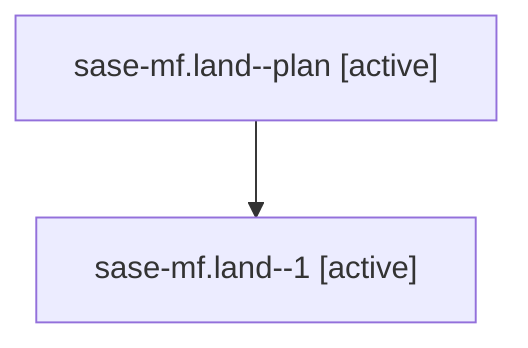

# Family: sase-mf.land

[Agent Hoods](../README.md) / [bbugyi200](../users/bbugyi200/README.md) / [athena](../users/bbugyi200/machines/athena/README.md) / [sase-mf](../users/bbugyi200/machines/athena/hoods/sase-mf/README.md) / sase-mf.land

Owner: `bbugyi200.athena` · Hood: `sase-mf` · Members: 2 · Bead: [sase-mf](https://github.com/sase-org/sase--beads/blob/main/pages/sase-mf/README.md)

## Lineage

The diagram is an optional enhancement; the ordered table below contains the same lineage in accessible text.

| Role | Agent | State | Model / provider | Timing | Commits | Prompt | Chat |
|---|---|---|---|---|---:|---|---|
| plan | sase-mf.land--plan | active | gpt-5.6-sol / codex | 2026-08-16T04:56:02.538704+00:00 | 0 | [Prompt](../agents/bbugyi200.athena.sase-mf.land--plan/prompt.md) | [Chat](../agents/bbugyi200.athena.sase-mf.land--plan/chat.md) |
| 1 | sase-mf.land--1 | active | opus / claude | 2026-08-16T05:10:21.214361+00:00 | [1](../agents/bbugyi200.athena.sase-mf.land--1/README.md#commits) | — | — |

## Commits

| Role | Repo | Commit | Subject | Committed |
|---|---|---|---|---|
| 1 | sase | [`0f63a62`](https://github.com/sase-org/sase/commit/0f63a62abc8e533fb0f61196d4bc60e0999e2950) | test(ace): refresh the visual goldens stranded by the launch-default pill stub | 2026-08-16 02:05:54 EDT |

## Neighbors

| Agent | Relation | State |
|---|---|---|
| [sase-mf.1](../agents/bbugyi200.athena.sase-mf.1/README.md) | sase-mf hood | completed |
| [sase-mf.2](../agents/bbugyi200.athena.sase-mf.2/README.md) | sase-mf hood | completed |
| [sase-mf.3](../agents/bbugyi200.athena.sase-mf.3/README.md) | sase-mf hood | dismissed |
| [sase-mf.4](../agents/bbugyi200.athena.sase-mf.4/README.md) | sase-mf hood | completed |
