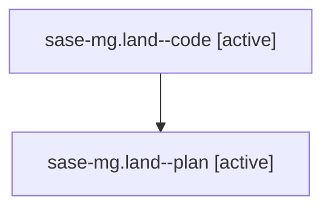

# Family: sase-mg.land

[Agent Hoods](../README.md) / [bbugyi200](../users/bbugyi200/README.md) / [athena](../users/bbugyi200/machines/athena/README.md) / [sase-mg](../users/bbugyi200/machines/athena/hoods/sase-mg/README.md) / sase-mg.land

Owner: `bbugyi200.athena` · Hood: `sase-mg` · Members: 2 · Bead: [sase-mg](https://github.com/sase-org/sase--beads/blob/main/pages/sase-mg/README.md)

## Lineage

The diagram is an optional enhancement; the ordered table below contains the same lineage in accessible text.

| Role | Agent | State | Model / provider | Timing | Commits | Prompt | Chat |
|---|---|---|---|---|---:|---|---|
| code | sase-mg.land--code | active | gpt-5.5 / codex | 2026-08-15T22:41:06.636778+00:00 | 0 | — | — |
| plan | sase-mg.land--plan | active | gpt-5.6-sol / codex | 2026-08-15T22:31:26.784206+00:00 | 0 | [Prompt](../agents/bbugyi200.athena.sase-mg.land--plan/prompt.md) | [Chat](../agents/bbugyi200.athena.sase-mg.land--plan/chat.md) |

## Neighbors

| Agent | Relation | State |
|---|---|---|
| [sase-mg.land.w0](../agents/bbugyi200.athena.sase-mg.land.w0/README.md) | descendant | waiting |
| [sase-mg.1](../agents/bbugyi200.athena.sase-mg.1/README.md) | sase-mg hood | completed |
| [sase-mg.2](../agents/bbugyi200.athena.sase-mg.2/README.md) | sase-mg hood | completed |
| [sase-mg.3](../agents/bbugyi200.athena.sase-mg.3/README.md) | sase-mg hood | completed |
| [sase-mg.4](../agents/bbugyi200.athena.sase-mg.4/README.md) | sase-mg hood | completed |
