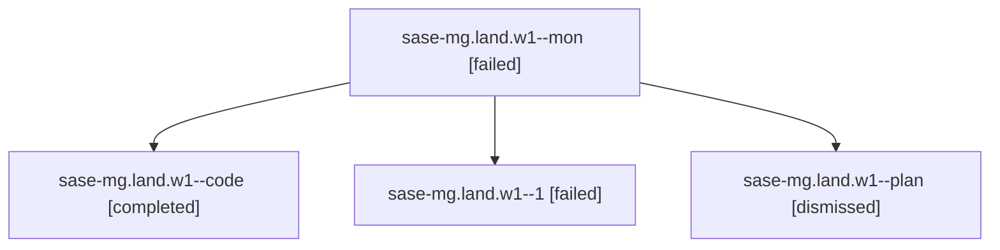

# Family: sase-mg.land.w1

[Agent Hoods](../README.md) / [bbugyi200](../users/bbugyi200/README.md) / [athena](../users/bbugyi200/machines/athena/README.md) / [sase-mg](../users/bbugyi200/machines/athena/hoods/sase-mg/README.md) / sase-mg.land.w1

Owner: `bbugyi200.athena` · Hood: `sase-mg` · Members: 4

## Lineage

The diagram is an optional enhancement; the ordered table below contains the same lineage in accessible text.

| Role | Agent | State | Model / provider | Timing | Commits | Prompt | Chat |
|---|---|---|---|---|---:|---|---|
| mon | sase-mg.land.w1--mon | failed | grok-4.6 / grok | 2026-08-15T23:32:34.110123+00:00 | 0 | — | [Chat](../agents/bbugyi200.athena.sase-mg.land.w1--mon/chat.md) |
| code | sase-mg.land.w1--code | completed | grok-4.6 / grok | 2026-08-15T23:03:41.111529+00:00 | 0 | — | [Chat](../agents/bbugyi200.athena.sase-mg.land.w1--code/chat.md) |
| 1 | sase-mg.land.w1--1 | failed | grok-4.6 / grok | 2026-08-15T23:47:19.777338+00:00 | [1](../agents/bbugyi200.athena.sase-mg.land.w1--1/README.md#commits) | [Prompt](../agents/bbugyi200.athena.sase-mg.land.w1--1/prompt.md) | — |
| plan | sase-mg.land.w1--plan | dismissed | — | 2026-08-15T16:54:57 | 0 | — | — |

## Commits

| Role | Repo | Commit | Subject | Committed |
|---|---|---|---|---|
| 1 | sase | [`8e06aef`](https://github.com/sase-org/sase/commit/8e06aef3f4a88b38174374faf8b60c47e263e7cf) | feat(cli)!: fold sase var show into sase var get | 2026-08-15 19:55:13 EDT |

## Neighbors

| Agent | Relation | State |
|---|---|---|
| [sase-mg.land](bbugyi200.athena.sase-mg.land.md) (family · 2) | ancestor | completed 2 |
| [sase-mg.1](../agents/bbugyi200.athena.sase-mg.1/README.md) | sase-mg hood | completed |
| [sase-mg.2](../agents/bbugyi200.athena.sase-mg.2/README.md) | sase-mg hood | completed |
| [sase-mg.3](../agents/bbugyi200.athena.sase-mg.3/README.md) | sase-mg hood | completed |
| [sase-mg.4](../agents/bbugyi200.athena.sase-mg.4/README.md) | sase-mg hood | completed |
