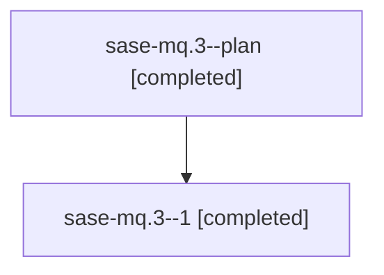

# Family: sase-mq.3

[Agent Hoods](../README.md) / [bbugyi200](../users/bbugyi200/README.md) / [athena](../users/bbugyi200/machines/athena/README.md) / [sase-mq](../users/bbugyi200/machines/athena/hoods/sase-mq/README.md) / sase-mq.3

Owner: `bbugyi200.athena` · Hood: `sase-mq` · Members: 2 · Bead: [sase-mq.3](https://github.com/sase-org/sase--beads/blob/main/pages/sase-mq/sase-mq.3.md)

## Lineage

The diagram is an optional enhancement; the ordered table below contains the same lineage in accessible text.

| Role | Agent | State | Model / provider | Timing | Commits | Prompt | Chat |
|---|---|---|---|---|---:|---|---|
| plan | sase-mq.3--plan | completed | grok-4.6 / grok | 2026-08-16T05:36:35.976942+00:00 | 0 | [Prompt](../agents/bbugyi200.athena.sase-mq.3--plan/prompt.md) | [Chat](../agents/bbugyi200.athena.sase-mq.3--plan/chat.md) |
| 1 | sase-mq.3--1 | completed | grok-4.6 / grok | 2026-08-16T06:00:14.230465+00:00 | [1](../agents/bbugyi200.athena.sase-mq.3--1/README.md#commits) | — | [Chat](../agents/bbugyi200.athena.sase-mq.3--1/chat.md) |

## Commits

| Role | Repo | Commit | Subject | Committed |
|---|---|---|---|---|
| 1 | sase | [`985aae2`](https://github.com/sase-org/sase/commit/985aae20c132bf9d5c629820f330cc12eef174a2) | feat(workspace): add reset-and-replay recovery for leased checkouts | 2026-08-16 02:28:11 EDT |

## Neighbors

| Agent | Relation | State |
|---|---|---|
| [sase-mq.1](../agents/bbugyi200.athena.sase-mq.1/README.md) | sase-mq hood | completed |
| [sase-mq.2](bbugyi200.athena.sase-mq.2.md) (family · 3) | sase-mq hood | completed 2, failed 1 |
| [sase-mq.4](bbugyi200.athena.sase-mq.4.md) (family · 3) | sase-mq hood | completed 2, failed 1 |
| [sase-mq.5](../agents/bbugyi200.athena.sase-mq.5/README.md) | sase-mq hood | completed |
| [sase-mq.6](../agents/bbugyi200.athena.sase-mq.6/README.md) | sase-mq hood | completed |
| [sase-mq.7](../agents/bbugyi200.athena.sase-mq.7/README.md) | sase-mq hood | completed |
| [sase-mq.8.1](../agents/bbugyi200.athena.sase-mq.8.1/README.md) | sase-mq hood | completed |
| [sase-mq.8.2](../agents/bbugyi200.athena.sase-mq.8.2/README.md) | sase-mq hood | completed |
| [sase-mq.8.3](../agents/bbugyi200.athena.sase-mq.8.3/README.md) | sase-mq hood | completed |
| [sase-mq.8.4](../agents/bbugyi200.athena.sase-mq.8.4/README.md) | sase-mq hood | completed |
| [sase-mq.8.land](bbugyi200.athena.sase-mq.8.land.md) (family · 3) | sase-mq hood | active 2, failed 1 |
| [sase-mq.land](bbugyi200.athena.sase-mq.land.md) (family · 2) | sase-mq hood | failed 2 |
