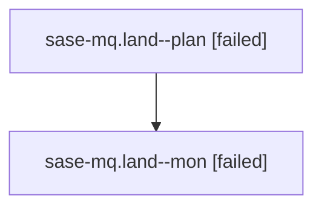

# Family: sase-mq.land

[Agent Hoods](../README.md) / [bbugyi200](../users/bbugyi200/README.md) / [athena](../users/bbugyi200/machines/athena/README.md) / [sase-mq](../users/bbugyi200/machines/athena/hoods/sase-mq/README.md) / sase-mq.land

Owner: `bbugyi200.athena` · Hood: `sase-mq` · Members: 2 · Bead: [sase-mq](https://github.com/sase-org/sase--beads/blob/main/pages/sase-mq/README.md)

## Lineage

The diagram is an optional enhancement; the ordered table below contains the same lineage in accessible text.

| Role | Agent | State | Model / provider | Timing | Commits | Prompt | Chat |
|---|---|---|---|---|---:|---|---|
| plan | sase-mq.land--plan | failed | opus / claude | 2026-08-16T08:19:46.976621+00:00 | 0 | [Prompt](../agents/bbugyi200.athena.sase-mq.land--plan/prompt.md) | [Chat](../agents/bbugyi200.athena.sase-mq.land--plan/chat.md) |
| mon | sase-mq.land--mon | failed | opus / claude | 2026-08-16T08:51:27.943985+00:00 | 0 | — | [Chat](../agents/bbugyi200.athena.sase-mq.land--mon/chat.md) |

## Neighbors

| Agent | Relation | State |
|---|---|---|
| [sase-mq.1](../agents/bbugyi200.athena.sase-mq.1/README.md) | sase-mq hood | completed |
| [sase-mq.2](bbugyi200.athena.sase-mq.2.md) (family · 3) | sase-mq hood | completed 2, failed 1 |
| [sase-mq.3](bbugyi200.athena.sase-mq.3.md) (family · 2) | sase-mq hood | completed 2 |
| [sase-mq.4](bbugyi200.athena.sase-mq.4.md) (family · 3) | sase-mq hood | completed 2, failed 1 |
| [sase-mq.5](../agents/bbugyi200.athena.sase-mq.5/README.md) | sase-mq hood | completed |
| [sase-mq.6](../agents/bbugyi200.athena.sase-mq.6/README.md) | sase-mq hood | completed |
| [sase-mq.7](../agents/bbugyi200.athena.sase-mq.7/README.md) | sase-mq hood | completed |
| [sase-mq.8.1](../agents/bbugyi200.athena.sase-mq.8.1/README.md) | sase-mq hood | active |
| [sase-mq.8.2](../agents/bbugyi200.athena.sase-mq.8.2/README.md) | sase-mq hood | active |
| [sase-mq.8.3](../agents/bbugyi200.athena.sase-mq.8.3/README.md) | sase-mq hood | completed |
| [sase-mq.8.4](../agents/bbugyi200.athena.sase-mq.8.4/README.md) | sase-mq hood | waiting |
| [sase-mq.8.land](../agents/bbugyi200.athena.sase-mq.8.land/README.md) | sase-mq hood | waiting |
