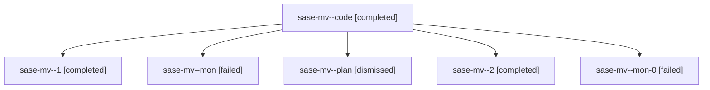

# Family: sase-mv

[Agent Hoods](../README.md) / [bbugyi200](../users/bbugyi200/README.md) / [athena](../users/bbugyi200/machines/athena/README.md) / [sase-mv](../users/bbugyi200/machines/athena/hoods/sase-mv/README.md) / sase-mv

Owner: `bbugyi200.athena` · Hood: `sase-mv` · Members: 6 · Bead: [sase-mv](https://github.com/sase-org/sase--beads/blob/main/pages/sase-mv/README.md)

## Lineage

The diagram is an optional enhancement; the ordered table below contains the same lineage in accessible text.

| Role | Agent | State | Model / provider | Timing | Commits | Prompt | Chat |
|---|---|---|---|---|---:|---|---|
| code | sase-mv--code | completed | grok-4.6 / grok | 2026-08-17T13:13:17.143527+00:00 | 0 | — | [Chat](../agents/bbugyi200.athena.sase-mv--code/chat.md) |
| 1 | sase-mv--1 | completed | grok-4.6 / grok | 2026-08-17T14:06:55.544835+00:00 | 0 | [Prompt](../agents/bbugyi200.athena.sase-mv--1/prompt.md) | [Chat](../agents/bbugyi200.athena.sase-mv--1/chat.md) |
| mon | sase-mv--mon | failed | grok-4.6 / grok | 2026-08-17T13:43:54.432401+00:00 | 0 | — | [Chat](../agents/bbugyi200.athena.sase-mv--mon/chat.md) |
| plan | sase-mv--plan | dismissed | — | 2026-08-17T08:55:46 | 0 | — | — |
| 2 | sase-mv--2 | completed | grok-4.6 / grok | 2026-08-17T15:11:24.848755+00:00 | 0 | [Prompt](../agents/bbugyi200.athena.sase-mv--2/prompt.md) | [Chat](../agents/bbugyi200.athena.sase-mv--2/chat.md) |
| mon-0 | sase-mv--mon-0 | failed | grok-4.6 / grok | 2026-08-17T14:43:42.598021+00:00 | 0 | — | [Chat](../agents/bbugyi200.athena.sase-mv--mon-0/chat.md) |

## Commits

| Role | Repo | Commit | Subject | Committed |
|---|---|---|---|---|
| — | sase | [`2959d39`](https://github.com/sase-org/sase/commit/2959d3992cc03570bf45db718c1bdaa65a2e51d1) | fix(ace-tui): stop leaked proc-observer threads between tests | 2026-08-17 11:32:01 EDT |
