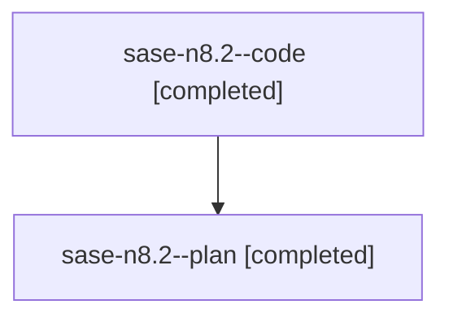

# Family: sase-n8.2

[Agent Hoods](../README.md) / [bbugyi200](../users/bbugyi200/README.md) / [athena](../users/bbugyi200/machines/athena/README.md) / [sase-n8](../users/bbugyi200/machines/athena/hoods/sase-n8/README.md) / sase-n8.2

Owner: `bbugyi200.athena` · Hood: `sase-n8` · Members: 2 · Bead: [sase-n8.2](https://github.com/sase-org/sase--beads/blob/main/pages/sase-n8/sase-n8.2.md)

## Lineage

The diagram is an optional enhancement; the ordered table below contains the same lineage in accessible text.

| Role | Agent | State | Model / provider | Timing | Commits | Prompt | Chat |
|---|---|---|---|---|---:|---|---|
| code | sase-n8.2--code | completed | grok-4.6 / grok | 2026-08-16T15:46:06.650091+00:00 | 0 | — | [Chat](../agents/bbugyi200.athena.sase-n8.2--code/chat.md) |
| plan | sase-n8.2--plan | completed | gpt-5.6-sol / codex | 2026-08-16T15:41:54.636224+00:00 | 0 | [Prompt](../agents/bbugyi200.athena.sase-n8.2--plan/prompt.md) | [Chat](../agents/bbugyi200.athena.sase-n8.2--plan/chat.md) |

## Neighbors

| Agent | Relation | State |
|---|---|---|
| [sase-n8.1](bbugyi200.athena.sase-n8.1.md) (family · 2) | sase-n8 hood | completed 2 |
| [sase-n8.3](../agents/bbugyi200.athena.sase-n8.3/README.md) | sase-n8 hood | completed |
| [sase-n8.4](../agents/bbugyi200.athena.sase-n8.4/README.md) | sase-n8 hood | completed |
| [sase-n8.5](../agents/bbugyi200.athena.sase-n8.5/README.md) | sase-n8 hood | completed |
| [sase-n8.6](bbugyi200.athena.sase-n8.6.md) (family · 2) | sase-n8 hood | completed 2 |
| [sase-n8.7](../agents/bbugyi200.athena.sase-n8.7/README.md) | sase-n8 hood | completed |
| [sase-n8.8](bbugyi200.athena.sase-n8.8.md) (family · 15) | sase-n8 hood | active 2, completed 6, failed 7 |
| [sase-n8.8](../agents/bbugyi200.athena.sase-n8.8/README.md) | sase-n8 hood | waiting |
| [sase-n8.9](../agents/bbugyi200.athena.sase-n8.9/README.md) | sase-n8 hood | waiting |
| [sase-n8.land](../agents/bbugyi200.athena.sase-n8.land/README.md) | sase-n8 hood | waiting |
