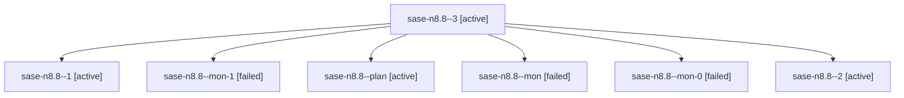

# Family: sase-n8.8

[Agent Hoods](../README.md) / [bbugyi200](../users/bbugyi200/README.md) / [athena](../users/bbugyi200/machines/athena/README.md) / [sase-n8](../users/bbugyi200/machines/athena/hoods/sase-n8/README.md) / sase-n8.8

Owner: `bbugyi200.athena` · Hood: `sase-n8` · Members: 7 · Bead: [sase-n8.8](https://github.com/sase-org/sase--beads/blob/main/pages/sase-n8/sase-n8.8.md)

## Lineage

The diagram is an optional enhancement; the ordered table below contains the same lineage in accessible text.

| Role | Agent | State | Model / provider | Timing | Commits | Prompt | Chat |
|---|---|---|---|---|---:|---|---|
| 3 | sase-n8.8--3 | active | gpt-5.5 / codex | 2026-08-16T20:52:34.976214+00:00 | 0 | [Prompt](../agents/bbugyi200.athena.sase-n8.8--3/prompt.md) | — |
| 1 | sase-n8.8--1 | active | gpt-5.5 / codex | 2026-08-16T20:15:56.835563+00:00 | 0 | [Prompt](../agents/bbugyi200.athena.sase-n8.8--1/prompt.md) | — |
| mon-1 | sase-n8.8--mon-1 | failed | gpt-5.5 / codex | 2026-08-16T20:43:22.911685+00:00 | 0 | — | [Chat](../agents/bbugyi200.athena.sase-n8.8--mon-1/chat.md) |
| plan | sase-n8.8--plan | active | gpt-5.5 / codex | 2026-08-16T20:09:26.195527+00:00 | 0 | [Prompt](../agents/bbugyi200.athena.sase-n8.8--plan/prompt.md) | — |
| mon | sase-n8.8--mon | failed | gpt-5.5 / codex | 2026-08-16T20:12:27.552753+00:00 | 0 | — | [Chat](../agents/bbugyi200.athena.sase-n8.8--mon/chat.md) |
| mon-0 | sase-n8.8--mon-0 | failed | gpt-5.5 / codex | 2026-08-16T20:19:59.872846+00:00 | 0 | — | [Chat](../agents/bbugyi200.athena.sase-n8.8--mon-0/chat.md) |
| 2 | sase-n8.8--2 | active | gpt-5.5 / codex | 2026-08-16T20:41:35.074004+00:00 | 0 | [Prompt](../agents/bbugyi200.athena.sase-n8.8--2/prompt.md) | — |

## Neighbors

| Agent | Relation | State |
|---|---|---|
| [sase-n8.1](bbugyi200.athena.sase-n8.1.md) (family · 2) | sase-n8 hood | completed 2 |
| [sase-n8.2](bbugyi200.athena.sase-n8.2.md) (family · 2) | sase-n8 hood | completed 2 |
| [sase-n8.3](../agents/bbugyi200.athena.sase-n8.3/README.md) | sase-n8 hood | completed |
| [sase-n8.4](../agents/bbugyi200.athena.sase-n8.4/README.md) | sase-n8 hood | completed |
| [sase-n8.5](../agents/bbugyi200.athena.sase-n8.5/README.md) | sase-n8 hood | completed |
| [sase-n8.6](bbugyi200.athena.sase-n8.6.md) (family · 2) | sase-n8 hood | completed 2 |
| [sase-n8.7](../agents/bbugyi200.athena.sase-n8.7/README.md) | sase-n8 hood | completed |
| [sase-n8.9](../agents/bbugyi200.athena.sase-n8.9/README.md) | sase-n8 hood | waiting |
| [sase-n8.land](../agents/bbugyi200.athena.sase-n8.land/README.md) | sase-n8 hood | waiting |
