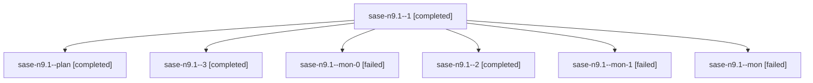

# Family: sase-n9.1

[Agent Hoods](../README.md) / [bbugyi200](../users/bbugyi200/README.md) / [athena](../users/bbugyi200/machines/athena/README.md) / [sase-n9](../users/bbugyi200/machines/athena/hoods/sase-n9/README.md) / sase-n9.1

Owner: `bbugyi200.athena` · Hood: `sase-n9` · Members: 7 · Bead: [sase-n9.1](https://github.com/sase-org/sase--beads/blob/main/pages/sase-n9/sase-n9.1.md)

## Lineage

The diagram is an optional enhancement; the ordered table below contains the same lineage in accessible text.

| Role | Agent | State | Model / provider | Timing | Commits | Prompt | Chat |
|---|---|---|---|---|---:|---|---|
| 1 | sase-n9.1--1 | completed | sonnet / claude | 2026-08-16T16:24:34.477049+00:00 | 0 | [Prompt](../agents/bbugyi200.athena.sase-n9.1--1/prompt.md) | [Chat](../agents/bbugyi200.athena.sase-n9.1--1/chat.md) |
| plan | sase-n9.1--plan | completed | sonnet / claude | 2026-08-16T16:04:18.078363+00:00 | 0 | [Prompt](../agents/bbugyi200.athena.sase-n9.1--plan/prompt.md) | [Chat](../agents/bbugyi200.athena.sase-n9.1--plan/chat.md) |
| 3 | sase-n9.1--3 | completed | sonnet / claude | 2026-08-16T16:55:22.516639+00:00 | [1](../agents/bbugyi200.athena.sase-n9.1--3/README.md#commits) | [Prompt](../agents/bbugyi200.athena.sase-n9.1--3/prompt.md) | [Chat](../agents/bbugyi200.athena.sase-n9.1--3/chat.md) |
| mon-0 | sase-n9.1--mon-0 | failed | sonnet / claude | 2026-08-16T16:25:21.749740+00:00 | 0 | — | [Chat](../agents/bbugyi200.athena.sase-n9.1--mon-0/chat.md) |
| 2 | sase-n9.1--2 | completed | sonnet / claude | 2026-08-16T16:35:37.595995+00:00 | 0 | [Prompt](../agents/bbugyi200.athena.sase-n9.1--2/prompt.md) | [Chat](../agents/bbugyi200.athena.sase-n9.1--2/chat.md) |
| mon-1 | sase-n9.1--mon-1 | failed | sonnet / claude | 2026-08-16T16:37:14.735812+00:00 | 0 | — | [Chat](../agents/bbugyi200.athena.sase-n9.1--mon-1/chat.md) |
| mon | sase-n9.1--mon | failed | sonnet / claude | 2026-08-16T16:24:01.297496+00:00 | 0 | — | [Chat](../agents/bbugyi200.athena.sase-n9.1--mon/chat.md) |

## Commits

| Role | Repo | Commit | Subject | Committed |
|---|---|---|---|---|
| 3 | sase | [`ddef1f0`](https://github.com/sase-org/sase/commit/ddef1f0d42a711729b6e322a6575e47fe3046a3a) | feat(ace): share agent-family plan/bead preview across TUI and editor | 2026-08-16 13:08:14 EDT |

## Neighbors

| Agent | Relation | State |
|---|---|---|
| [sase-n9.2](../agents/bbugyi200.athena.sase-n9.2/README.md) | sase-n9 hood | completed |
| [sase-n9.3](bbugyi200.athena.sase-n9.3.md) (family · 3) | sase-n9 hood | completed 2, failed 1 |
| [sase-n9.4](bbugyi200.athena.sase-n9.4.md) (family · 3) | sase-n9 hood | completed 2, failed 1 |
| [sase-n9.land](bbugyi200.athena.sase-n9.land.md) (family · 2) | sase-n9 hood | completed 2 |
