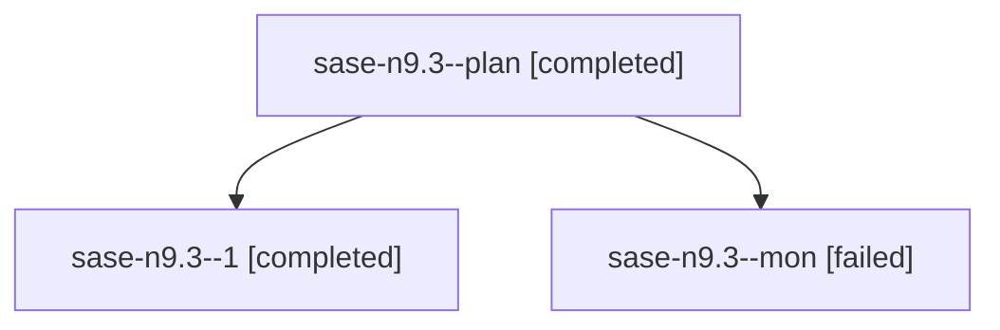

# Family: sase-n9.3

[Agent Hoods](../README.md) / [bbugyi200](../users/bbugyi200/README.md) / [athena](../users/bbugyi200/machines/athena/README.md) / [sase-n9](../users/bbugyi200/machines/athena/hoods/sase-n9/README.md) / sase-n9.3

Owner: `bbugyi200.athena` · Hood: `sase-n9` · Members: 3 · Bead: [sase-n9.3](https://github.com/sase-org/sase--beads/blob/main/pages/sase-n9/sase-n9.3.md)

## Lineage

The diagram is an optional enhancement; the ordered table below contains the same lineage in accessible text.

| Role | Agent | State | Model / provider | Timing | Commits | Prompt | Chat |
|---|---|---|---|---|---:|---|---|
| plan | sase-n9.3--plan | completed | sonnet / claude | 2026-08-16T17:10:07.989252+00:00 | 0 | [Prompt](../agents/bbugyi200.athena.sase-n9.3--plan/prompt.md) | [Chat](../agents/bbugyi200.athena.sase-n9.3--plan/chat.md) |
| 1 | sase-n9.3--1 | completed | sonnet / claude | 2026-08-16T17:50:47.307604+00:00 | [1](../agents/bbugyi200.athena.sase-n9.3--1/README.md#commits) | [Prompt](../agents/bbugyi200.athena.sase-n9.3--1/prompt.md) | [Chat](../agents/bbugyi200.athena.sase-n9.3--1/chat.md) |
| mon | sase-n9.3--mon | failed | sonnet / claude | 2026-08-16T17:32:37.218331+00:00 | 0 | — | [Chat](../agents/bbugyi200.athena.sase-n9.3--mon/chat.md) |

## Commits

| Role | Repo | Commit | Subject | Committed |
|---|---|---|---|---|
| 1 | sase | [`15e1fda`](https://github.com/sase-org/sase/commit/15e1fda0c153e9024073a13cad131c73509afdf1) | feat(editor): enrich family entries in the agent-catalog helper | 2026-08-16 14:00:22 EDT |

## Neighbors

| Agent | Relation | State |
|---|---|---|
| [sase-n9.1](bbugyi200.athena.sase-n9.1.md) (family · 7) | sase-n9 hood | completed 4, failed 3 |
| [sase-n9.2](../agents/bbugyi200.athena.sase-n9.2/README.md) | sase-n9 hood | completed |
| [sase-n9.4](bbugyi200.athena.sase-n9.4.md) (family · 3) | sase-n9 hood | completed 2, failed 1 |
| [sase-n9.land](bbugyi200.athena.sase-n9.land.md) (family · 2) | sase-n9 hood | completed 2 |
