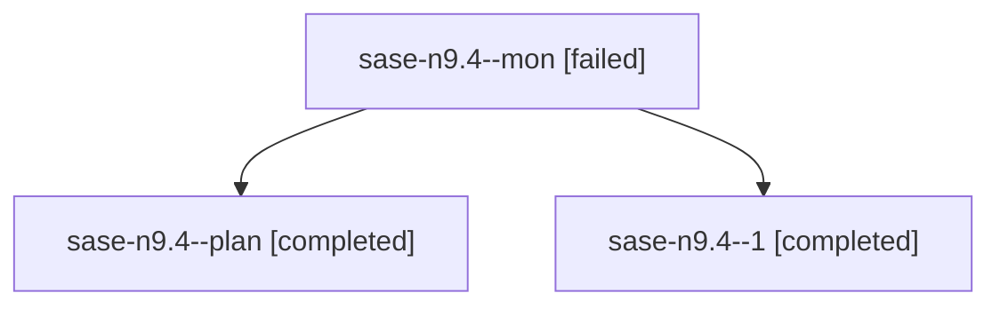

# Family: sase-n9.4

[Agent Hoods](../README.md) / [bbugyi200](../users/bbugyi200/README.md) / [athena](../users/bbugyi200/machines/athena/README.md) / [sase-n9](../users/bbugyi200/machines/athena/hoods/sase-n9/README.md) / sase-n9.4

Owner: `bbugyi200.athena` · Hood: `sase-n9` · Members: 3 · Bead: [sase-n9.4](https://github.com/sase-org/sase--beads/blob/main/pages/sase-n9/sase-n9.4.md)

## Lineage

The diagram is an optional enhancement; the ordered table below contains the same lineage in accessible text.

| Role | Agent | State | Model / provider | Timing | Commits | Prompt | Chat |
|---|---|---|---|---|---:|---|---|
| mon | sase-n9.4--mon | failed | grok-4.6 / grok | 2026-08-16T17:25:01.759445+00:00 | 0 | — | [Chat](../agents/bbugyi200.athena.sase-n9.4--mon/chat.md) |
| plan | sase-n9.4--plan | completed | grok-4.6 / grok | 2026-08-16T17:17:06.895468+00:00 | 0 | [Prompt](../agents/bbugyi200.athena.sase-n9.4--plan/prompt.md) | [Chat](../agents/bbugyi200.athena.sase-n9.4--plan/chat.md) |
| 1 | sase-n9.4--1 | completed | grok-4.6 / grok | 2026-08-16T17:28:34.851641+00:00 | 0 | [Prompt](../agents/bbugyi200.athena.sase-n9.4--1/prompt.md) | [Chat](../agents/bbugyi200.athena.sase-n9.4--1/chat.md) |

## Neighbors

| Agent | Relation | State |
|---|---|---|
| [sase-n9.1](bbugyi200.athena.sase-n9.1.md) (family · 7) | sase-n9 hood | completed 4, failed 3 |
| [sase-n9.2](../agents/bbugyi200.athena.sase-n9.2/README.md) | sase-n9 hood | active |
| [sase-n9.3](bbugyi200.athena.sase-n9.3.md) (family · 3) | sase-n9 hood | active 1, completed 1, failed 1 |
| [sase-n9.land](../agents/bbugyi200.athena.sase-n9.land/README.md) | sase-n9 hood | waiting |
