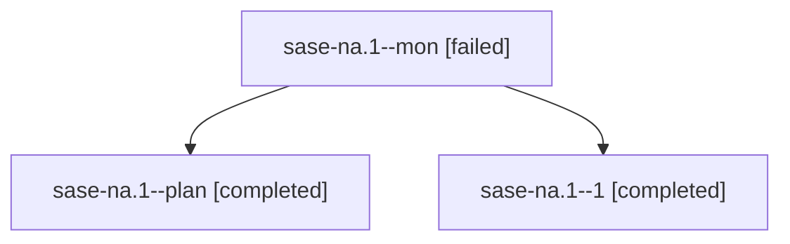

# Family: sase-na.1

[Agent Hoods](../README.md) / [bbugyi200](../users/bbugyi200/README.md) / [athena](../users/bbugyi200/machines/athena/README.md) / [sase-na](../users/bbugyi200/machines/athena/hoods/sase-na/README.md) / sase-na.1

Owner: `bbugyi200.athena` · Hood: `sase-na` · Members: 3 · Bead: [sase-na.1](https://github.com/sase-org/sase--beads/blob/main/pages/sase-na/sase-na.1.md)

## Lineage

The diagram is an optional enhancement; the ordered table below contains the same lineage in accessible text.

| Role | Agent | State | Model / provider | Timing | Commits | Prompt | Chat |
|---|---|---|---|---|---:|---|---|
| mon | sase-na.1--mon | failed | gpt-5.5 / codex | 2026-08-16T17:13:22.316548+00:00 | 0 | — | [Chat](../agents/bbugyi200.athena.sase-na.1--mon/chat.md) |
| plan | sase-na.1--plan | completed | gpt-5.5 / codex | 2026-08-16T16:23:17.629169+00:00 | [1](../agents/bbugyi200.athena.sase-na.1--plan/README.md#commits) | [Prompt](../agents/bbugyi200.athena.sase-na.1--plan/prompt.md) | [Chat](../agents/bbugyi200.athena.sase-na.1--plan/chat.md) |
| 1 | sase-na.1--1 | completed | gpt-5.5 / codex | 2026-08-16T17:21:00.986245+00:00 | 0 | [Prompt](../agents/bbugyi200.athena.sase-na.1--1/prompt.md) | [Chat](../agents/bbugyi200.athena.sase-na.1--1/chat.md) |

## Commits

| Role | Repo | Commit | Subject | Committed |
|---|---|---|---|---|
| plan | sase | [`ed39dd0`](https://github.com/sase-org/sase/commit/ed39dd0b886b7dcccd96a859aa856913b430787a) | feat: add prompt-word history index | 2026-08-16 17:21:31 UTC |

## Neighbors

| Agent | Relation | State |
|---|---|---|
| [sase-na.2](../agents/bbugyi200.athena.sase-na.2/README.md) | sase-na hood | completed |
| [sase-na.3](../agents/bbugyi200.athena.sase-na.3/README.md) | sase-na hood | completed |
| [sase-na.4](../agents/bbugyi200.athena.sase-na.4/README.md) | sase-na hood | completed |
| [sase-na.land](../agents/bbugyi200.athena.sase-na.land/README.md) | sase-na hood | completed |
