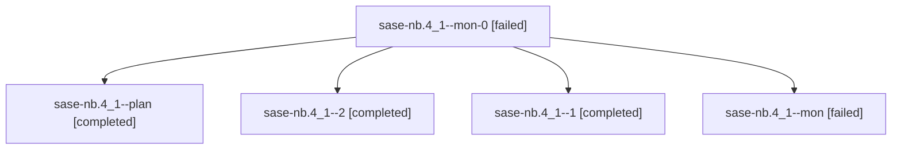

# Family: sase-nb.4\_1

[Agent Hoods](../README.md) / [bbugyi200](../users/bbugyi200/README.md) / [athena](../users/bbugyi200/machines/athena/README.md) / [sase-nb](../users/bbugyi200/machines/athena/hoods/sase-nb/README.md) / sase-nb.4\_1

Owner: `bbugyi200.athena` · Hood: `sase-nb` · Members: 5

## Lineage

The diagram is an optional enhancement; the ordered table below contains the same lineage in accessible text.

| Role | Agent | State | Model / provider | Timing | Commits | Prompt | Chat |
|---|---|---|---|---|---:|---|---|
| mon-0 | sase-nb.4\_1--mon-0 | failed | grok-4.6 / grok | 2026-08-16T21:10:14.175114+00:00 | 0 | — | [Chat](../agents/bbugyi200.athena.sase-nb.4_1--mon-0/chat.md) |
| plan | sase-nb.4\_1--plan | completed | grok-4.6 / grok | 2026-08-16T19:57:52.747159+00:00 | 0 | [Prompt](../agents/bbugyi200.athena.sase-nb.4_1--plan/prompt.md) | [Chat](../agents/bbugyi200.athena.sase-nb.4_1--plan/chat.md) |
| 2 | sase-nb.4\_1--2 | completed | grok-4.6 / grok | 2026-08-16T21:32:10.599353+00:00 | 0 | [Prompt](../agents/bbugyi200.athena.sase-nb.4_1--2/prompt.md) | [Chat](../agents/bbugyi200.athena.sase-nb.4_1--2/chat.md) |
| 1 | sase-nb.4\_1--1 | completed | grok-4.6 / grok | 2026-08-16T21:06:21.304430+00:00 | 0 | [Prompt](../agents/bbugyi200.athena.sase-nb.4_1--1/prompt.md) | [Chat](../agents/bbugyi200.athena.sase-nb.4_1--1/chat.md) |
| mon | sase-nb.4\_1--mon | failed | grok-4.6 / grok | 2026-08-16T20:40:01.145120+00:00 | 0 | — | [Chat](../agents/bbugyi200.athena.sase-nb.4_1--mon/chat.md) |

## Neighbors

| Agent | Relation | State |
|---|---|---|
| [sase-nb.1](../agents/bbugyi200.athena.sase-nb.1/README.md) | sase-nb hood | completed |
| [sase-nb.10](../agents/bbugyi200.athena.sase-nb.10/README.md) | sase-nb hood | waiting |
| [sase-nb.2](bbugyi200.athena.sase-nb.2.md) (family · 2) | sase-nb hood | completed 2 |
| [sase-nb.3](../agents/bbugyi200.athena.sase-nb.3/README.md) | sase-nb hood | completed |
| [sase-nb.4](../agents/bbugyi200.athena.sase-nb.4/README.md) | sase-nb hood | dismissed |
| [sase-nb.5](../agents/bbugyi200.athena.sase-nb.5/README.md) | sase-nb hood | completed |
| [sase-nb.6](../agents/bbugyi200.athena.sase-nb.6/README.md) | sase-nb hood | active |
| [sase-nb.7](../agents/bbugyi200.athena.sase-nb.7/README.md) | sase-nb hood | active |
| [sase-nb.8](bbugyi200.athena.sase-nb.8.md) (family · 2) | sase-nb hood | active 2 |
| [sase-nb.9](../agents/bbugyi200.athena.sase-nb.9/README.md) | sase-nb hood | waiting |
| [sase-nb.land](../agents/bbugyi200.athena.sase-nb.land/README.md) | sase-nb hood | waiting |
