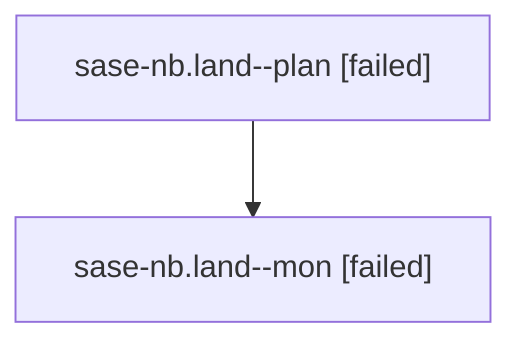

# Family: sase-nb.land

[Agent Hoods](../README.md) / [bbugyi200](../users/bbugyi200/README.md) / [athena](../users/bbugyi200/machines/athena/README.md) / [sase-nb](../users/bbugyi200/machines/athena/hoods/sase-nb/README.md) / sase-nb.land

Owner: `bbugyi200.athena` · Hood: `sase-nb` · Members: 2 · Bead: [sase-nb](https://github.com/sase-org/sase--beads/blob/main/pages/sase-nb/README.md)

## Lineage

The diagram is an optional enhancement; the ordered table below contains the same lineage in accessible text.

| Role | Agent | State | Model / provider | Timing | Commits | Prompt | Chat |
|---|---|---|---|---|---:|---|---|
| plan | sase-nb.land--plan | failed | opus / claude | 2026-08-17T00:39:34.480429+00:00 | 0 | [Prompt](../agents/bbugyi200.athena.sase-nb.land--plan/prompt.md) | [Chat](../agents/bbugyi200.athena.sase-nb.land--plan/chat.md) |
| mon | sase-nb.land--mon | failed | opus / claude | 2026-08-17T01:04:16.773778+00:00 | 0 | — | [Chat](../agents/bbugyi200.athena.sase-nb.land--mon/chat.md) |

## Neighbors

| Agent | Relation | State |
|---|---|---|
| [sase-nb.1](../agents/bbugyi200.athena.sase-nb.1/README.md) | sase-nb hood | completed |
| [sase-nb.10](../agents/bbugyi200.athena.sase-nb.10/README.md) | sase-nb hood | completed |
| [sase-nb.11.1](bbugyi200.athena.sase-nb.11.1.md) (family · 2) | sase-nb hood | active 2 |
| [sase-nb.11.2](../agents/bbugyi200.athena.sase-nb.11.2/README.md) | sase-nb hood | completed |
| [sase-nb.11.3](../agents/bbugyi200.athena.sase-nb.11.3/README.md) | sase-nb hood | active |
| [sase-nb.11.4](../agents/bbugyi200.athena.sase-nb.11.4/README.md) | sase-nb hood | active |
| [sase-nb.11.5](../agents/bbugyi200.athena.sase-nb.11.5/README.md) | sase-nb hood | completed |
| [sase-nb.11.land](../agents/bbugyi200.athena.sase-nb.11.land/README.md) | sase-nb hood | waiting |
| [sase-nb.2](bbugyi200.athena.sase-nb.2.md) (family · 2) | sase-nb hood | completed 2 |
| [sase-nb.3](../agents/bbugyi200.athena.sase-nb.3/README.md) | sase-nb hood | completed |
| [sase-nb.4](../agents/bbugyi200.athena.sase-nb.4/README.md) | sase-nb hood | dismissed |
| [sase-nb.4\_1](bbugyi200.athena.sase-nb.4_1.md) (family · 5) | sase-nb hood | completed 3, failed 2 |
| [sase-nb.5](../agents/bbugyi200.athena.sase-nb.5/README.md) | sase-nb hood | completed |
| [sase-nb.6](bbugyi200.athena.sase-nb.6.md) (family · 2) | sase-nb hood | completed 2 |
| [sase-nb.7](../agents/bbugyi200.athena.sase-nb.7/README.md) | sase-nb hood | completed |
| [sase-nb.8](bbugyi200.athena.sase-nb.8.md) (family · 2) | sase-nb hood | completed 2 |
| [sase-nb.9](../agents/bbugyi200.athena.sase-nb.9/README.md) | sase-nb hood | completed |
