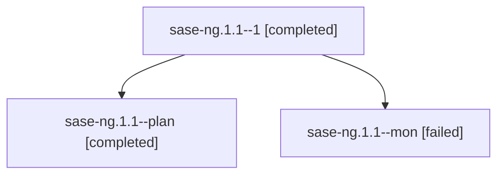

# Family: sase-ng.1.1

[Agent Hoods](../README.md) / [bbugyi200](../users/bbugyi200/README.md) / [athena](../users/bbugyi200/machines/athena/README.md) / [sase-ng](../users/bbugyi200/machines/athena/hoods/sase-ng/README.md) / sase-ng.1.1

Owner: `bbugyi200.athena` · Hood: `sase-ng` · Members: 3 · Bead: [sase-ng.1.1](https://github.com/sase-org/sase--beads/blob/main/pages/sase-ng/sase-ng.1.1.md)

## Lineage

The diagram is an optional enhancement; the ordered table below contains the same lineage in accessible text.

| Role | Agent | State | Model / provider | Timing | Commits | Prompt | Chat |
|---|---|---|---|---|---:|---|---|
| 1 | sase-ng.1.1--1 | completed | grok-4.6 / grok | 2026-08-17T19:49:42.786423+00:00 | 0 | [Prompt](../agents/bbugyi200.athena.sase-ng.1.1--1/prompt.md) | [Chat](../agents/bbugyi200.athena.sase-ng.1.1--1/chat.md) |
| plan | sase-ng.1.1--plan | completed | grok-4.6 / grok | 2026-08-17T19:18:01.633905+00:00 | 0 | [Prompt](../agents/bbugyi200.athena.sase-ng.1.1--plan/prompt.md) | [Chat](../agents/bbugyi200.athena.sase-ng.1.1--plan/chat.md) |
| mon | sase-ng.1.1--mon | failed | grok-4.6 / grok | 2026-08-17T19:47:31.665696+00:00 | 0 | — | [Chat](../agents/bbugyi200.athena.sase-ng.1.1--mon/chat.md) |

## Commits

| Role | Repo | Commit | Subject | Committed |
|---|---|---|---|---|
| — | sase | [`13e9ccb`](https://github.com/sase-org/sase/commit/13e9ccbc9b1b044fe1a56f8d3c505f65af235352) | fix(agent): consume force-reuse plans on the durable launch path | 2026-08-17 16:21:41 EDT |

## Neighbors

| Agent | Relation | State |
|---|---|---|
| [sase-ng](bbugyi200.athena.sase-ng.md) (family · 2) | ancestor | failed 2 |
| [sase-ng.1.2](../agents/bbugyi200.athena.sase-ng.1.2/README.md) | sase-ng.1 hood | completed |
| [sase-ng.1.3](../agents/bbugyi200.athena.sase-ng.1.3/README.md) | sase-ng.1 hood | completed |
| [sase-ng.1.4](../agents/bbugyi200.athena.sase-ng.1.4/README.md) | sase-ng.1 hood | active |
| [sase-ng.1.5](../agents/bbugyi200.athena.sase-ng.1.5/README.md) | sase-ng.1 hood | waiting |
| [sase-ng.1.6](../agents/bbugyi200.athena.sase-ng.1.6/README.md) | sase-ng.1 hood | waiting |
| [sase-ng.1.land](../agents/bbugyi200.athena.sase-ng.1.land/README.md) | sase-ng.1 hood | waiting |
